.. |info| image:: assets/images/wifi/info-icon.png
  :width: 1em

*************************
Robot Wi-Fi Network Setup
*************************

Use the following instructions to connect your robot to your local Wi-Fi network. For detailed network requirements, refer to :doc:`Network Administration: temi Robot <../network-admin/03_temi-robot>`.

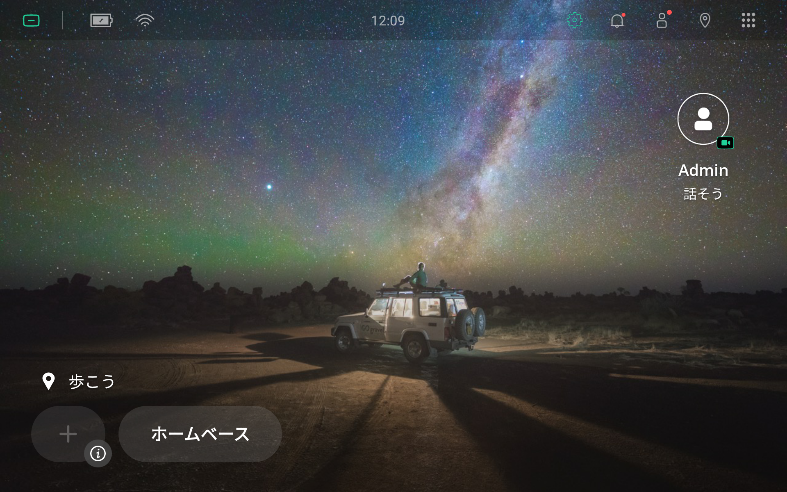

  Tap on the Wi-Fi icon |wifi| in the top left-hand corner of the screen to bring up the Wi-Fi network selection menu.

.. figure:: assets/images/wifi/wifi-network-selection.png 
  :alt: Wi-Fi network selection menu

  The Wi-Fi network selection menu lists all Wi-Fi networks visible to the robot.

General Wi-Fi Network
=====================
.. figure:: assets/images/wifi/wifi-network-selection.png 
  :alt: Wi-Fi network selection menu

  Your Wi-Fi network SSID should appear in the list. If it does not, try resetting the robot's Wi-Fi by switching it ``オフ`` and then ``オン`` again (see top right-hand corner of the screen).

  If you see your Wi-Fi network, tap on it. It should ask you to enter the Wi-Fi network's password.

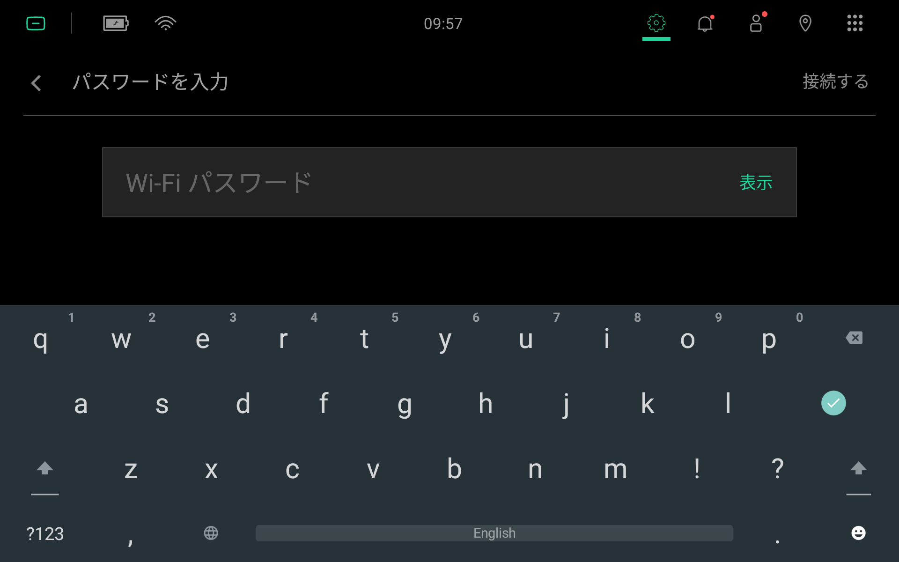

  Enter your Wi-Fi network's password. Your password will be hidden as you type. To unhide the password, tap ``表示``. If you want to use a different keyboard layout, refer to the section about :doc:`Switching Keyboards <02_keyboard>`.

  .. Caution:: Wi-Fi passwords are case-sensitive. 

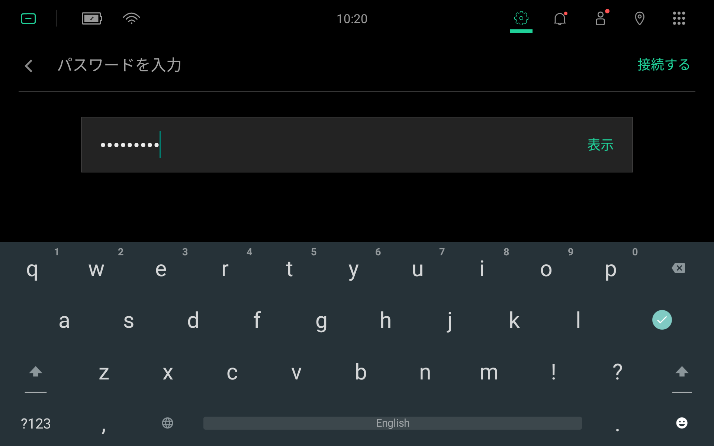

  After entering a valid password, ``接続する`` should appear highlighted in the top right-hand corner of the screen. Tap this to connect to the Wi-Fi network.

.. figure:: assets/images/wifi/wifi-successfully-connected.png 
  :alt: Successfully connected to Wi-Fi network

  If your robot is successfully connected to a Wi-Fi network, you will see ``接続されました`` directly below the Wi-Fi network name (or SSID).
  
  To the right of your connected Wi-Fi network, there should be an information icon |info|. Tap this to see some Wi-Fi connection details.

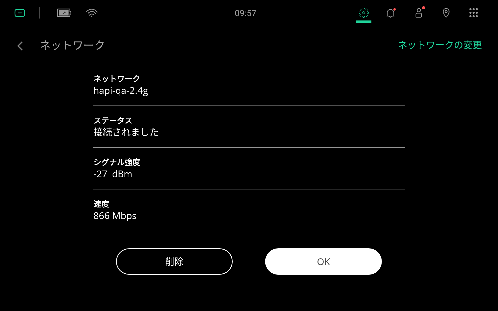

  The Wi-Fi connection details page show:
  
    - Network name (or SSID)
    - Status information, 
    - Signal strength (see :ref:`temi-robot-wifi-requirements` for requirements)
    - Network bandwidth

.. Note::
  The ``network bandwidth`` value in the connection details page is the connection bandwidth between the robot and Wi-Fi access point. It is `not` the internet bandwidth.

Hidden Wi-Fi Network
====================
If you are using a hidden Wi-Fi network, you will need to enter your Wi-Fi network details manually. To do this, scroll down to the bottom of the Wi-Fi network selection menu.

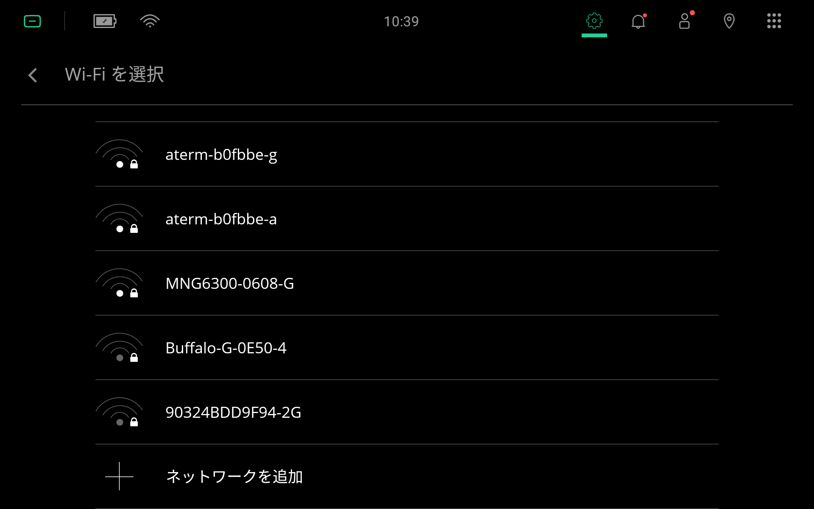

  At the bottom of the Wi-Fi network selection menu, there should be an option ``ネットワークを追加``, which will allow you to enter network details manually. Tap this to get started.

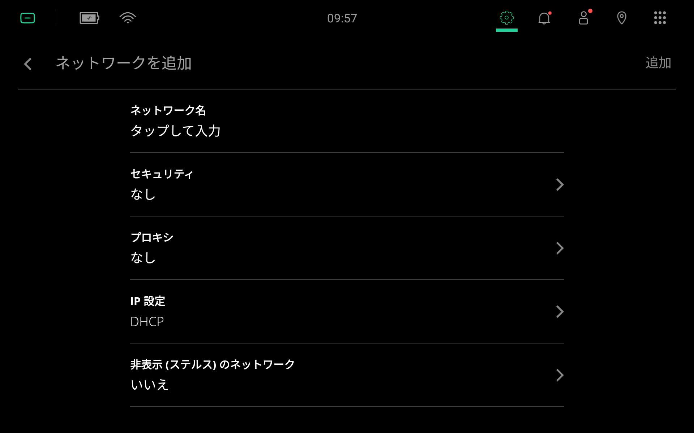

  This is the ``ネットワークを追加`` page for manually entering Wi-Fi network details. 
  
  Tap ``ネットワーク名`` to enter the Wi-Fi network's name (or SSID). 

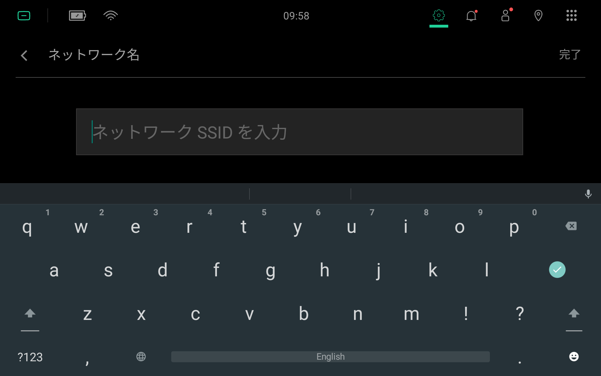

  Enter the name of your Wi-Fi network (or SSID). 
  
  .. Caution:: Wi-Fi network names (or SSIDs) are case-sensitive.

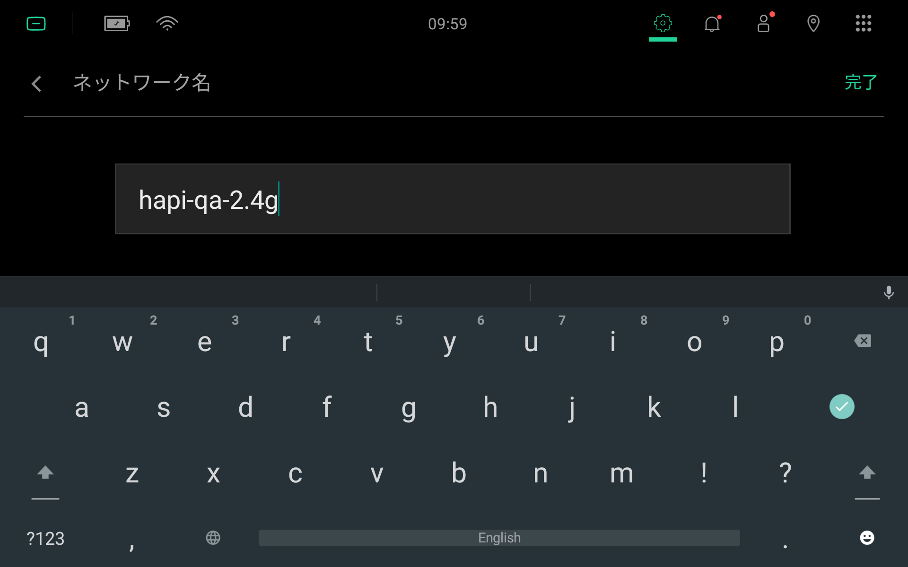

  After entering a name, ``完了`` should appear highlighted in the top right-hand corner of the screen. Tap this to save and return the ``ネットワークを追加`` page.

  From the ``ネットワークを追加`` page, tap ``セキュリテイ`` to select the Wi-Fi network's security type. 

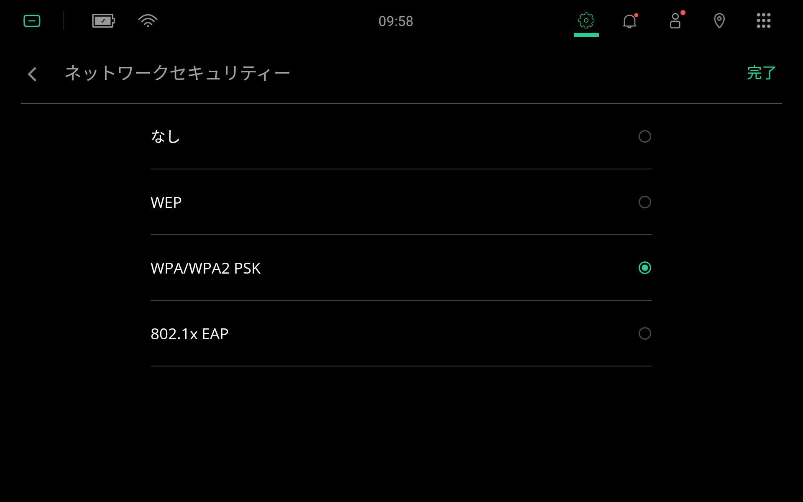

  Select your Wi-Fi network's security type. Tap ``完了`` to save the selection and return to the ``ネットワークを追加`` page.

  .. Tip:: For general home and/or small business networks, the Wi-Fi network's security type for a modern access point is usually ``WPA/WPA2 PSK``.

  If you have selected a Wi-Fi security type that is not ``なし``, you should see an option to enter your password. Tap ``パスワード`` to enter your Wi-Fi network's password.

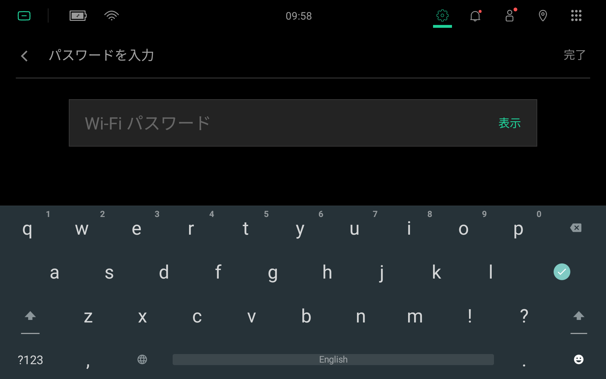

  Enter your Wi-Fi network's password. Your password will be hidden as you type. To unhide the password, tap ``表示``. 
  
  .. Caution:: Wi-Fi passwords are case-sensitive. 

  After entering a valid password, ``完了`` should appear highlighted in the top right-hand corner of the screen. Tap this to save the password and return to the ``ネットワークを追加`` page.

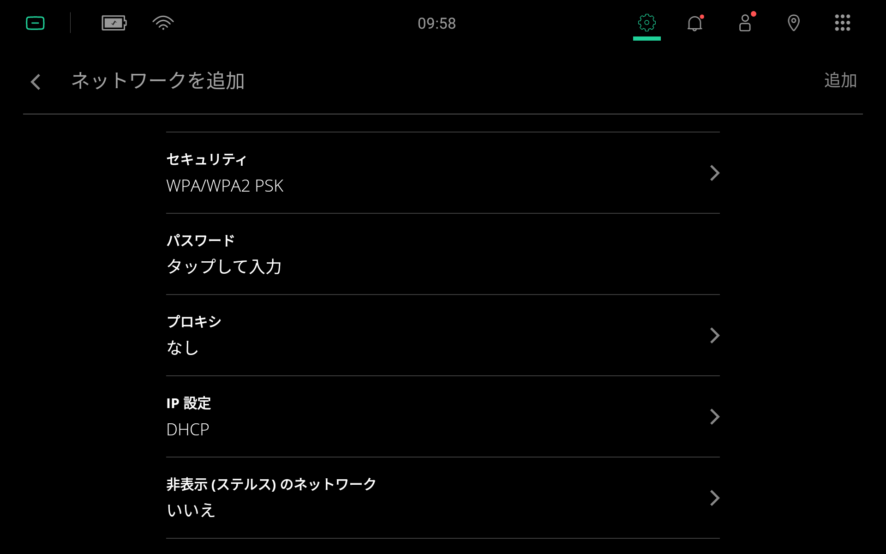

  Finally, scroll down to the bottom of the ``ネットワークを追加`` page. There should be an option ``非表示(ステルス)のネットワーク``. Tap this option to make your selection.

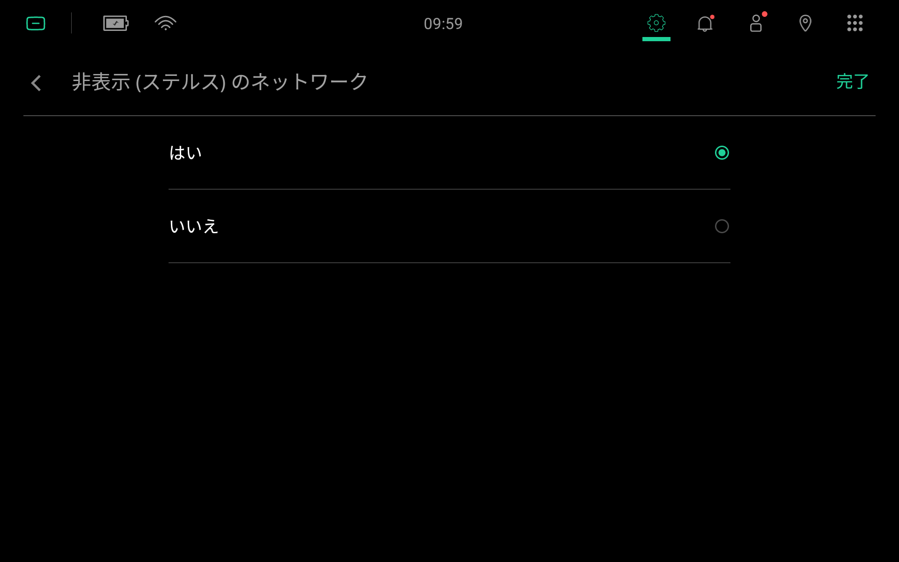

  Select ``はい`` to confirm that the network is hidden. Then tap ``完了`` in the top right-hand corner of the screen to save the selection and return to the ``ネットワークを追加`` page.

.. figure:: assets/images/wifi/wifi-manual-complete.png
  :alt: Add Wi-Fi Network page (Complete)

  In the ``ネットワークを追加`` page, carefully review your network details. If everything is correct, tap ``追加`` to save these settings and connect to the Wi-Fi network.

.. figure:: assets/images/wifi/wifi-successfully-connected.png 
  :alt: Successfully connected to Wi-Fi network

  If your robot is successfully connected to a Wi-Fi network, you will see ``接続されました`` directly below the Wi-Fi network name (or SSID).

Multiple Wi-Fi Networks
=======================

If you have connected your robot to multiple Wi-Fi networks, you will see those networks displayed in the Wi-Fi network selection menu.

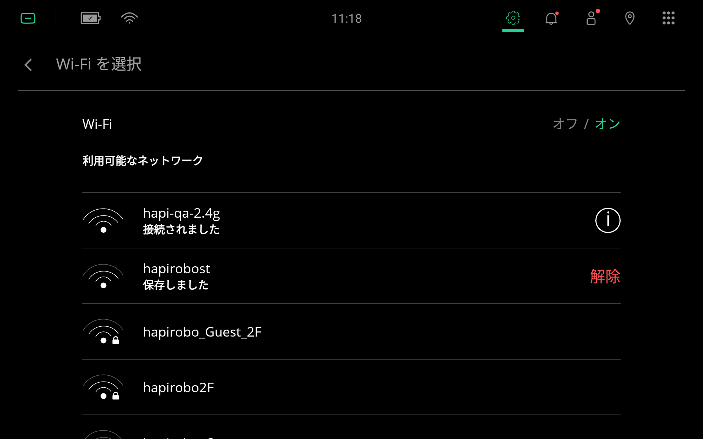

  All Wi-Fi networks that you have previously connected to will be shown in the Wi-Fi network selection menu as either ``接続されました`` or ``保存しました``.

The robot will automatically switch between Wi-Fi networks. 

.. Tip:: To improve network stability, it is generally recommended to save and to connect to only one Wi-Fi network. 

To forget previously saved Wi-Fi networks: Go to the Wi-Fi network selection menu, and next to the Wi-Fi network that you want the robot to forget:

  #. Tap on ``解除`` (if the robot is currently not connected to this Wi-Fi network), or
  #. Tap on the information icon |info| (if the robot is currently connected to this Wi-Fi network), and select ``解除``.

  From the Wi-Fi connection details page, tap on ``解除`` to forget this Wi-Fi network.

