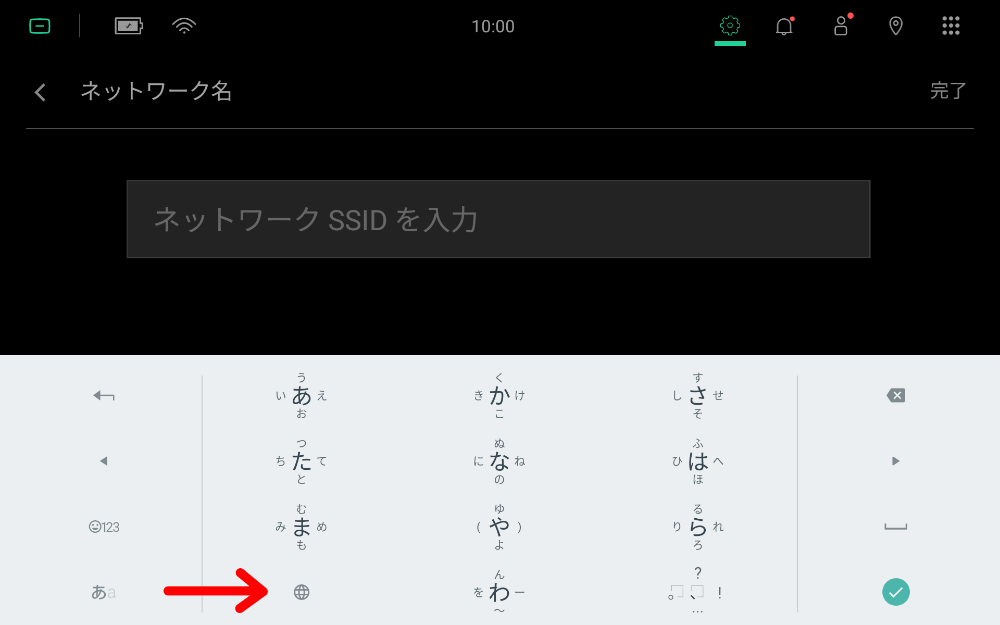
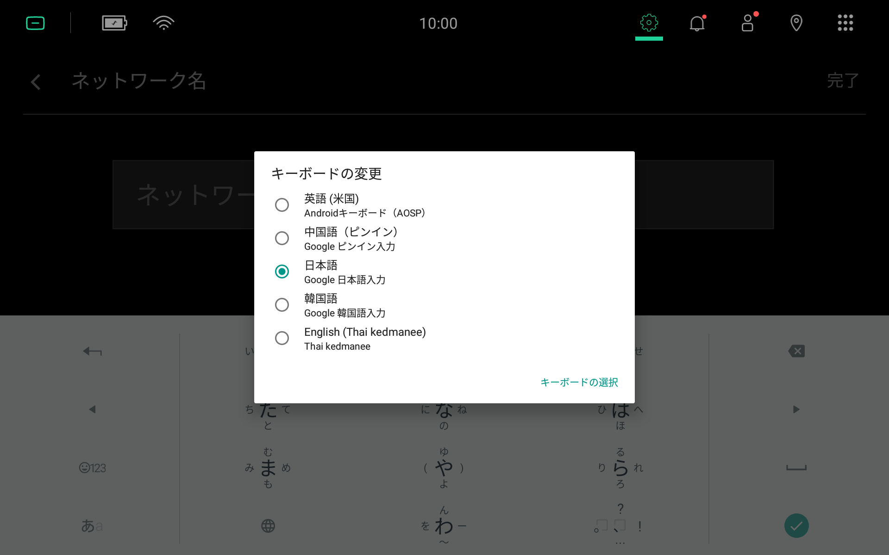
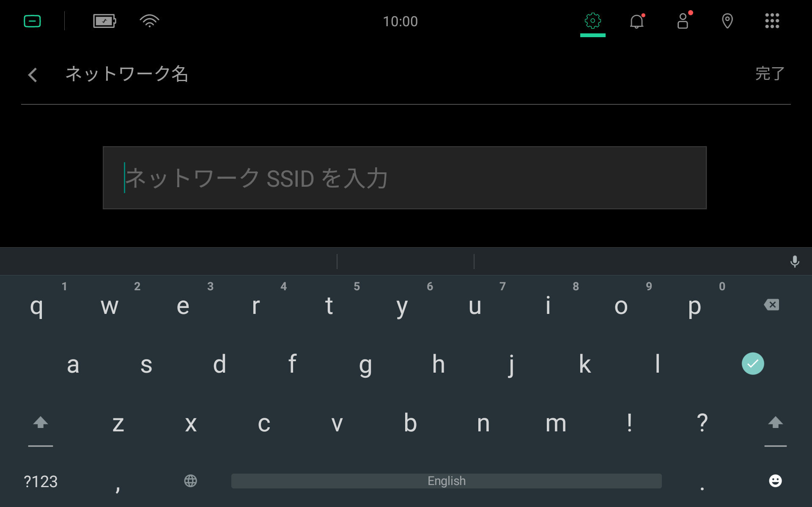
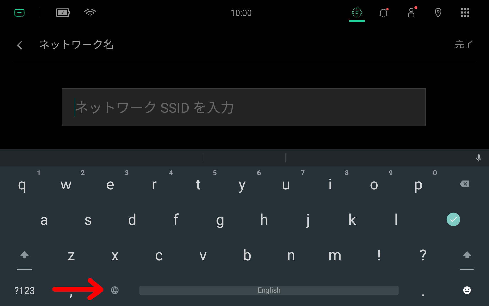
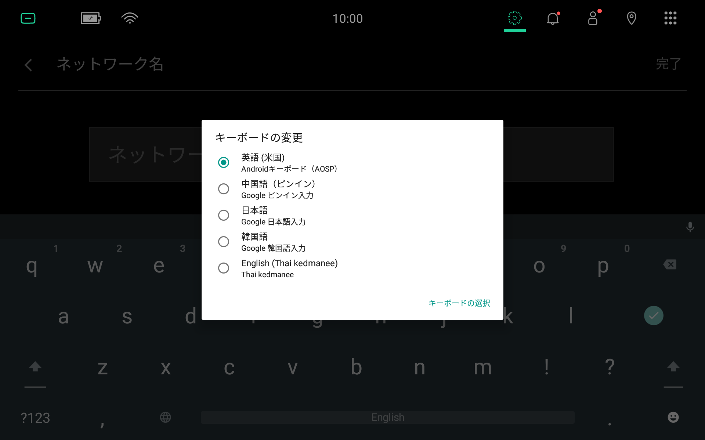
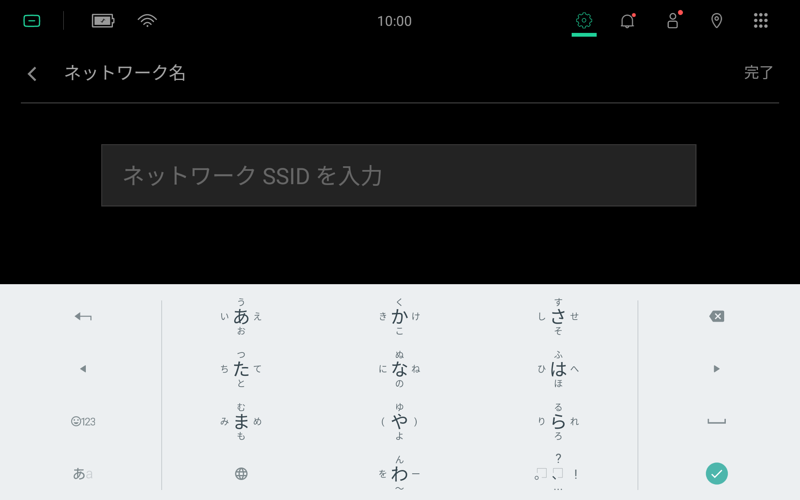

*******************
Switching Keyboards
*******************

From Japanese to English Keyboard
=================================

  To switch from a Japanese keyboard to an English keyboard, press and hold the globe button |globe|.

  A popup menu should appear. Selecting 英語(米国) should immediately switch to the English keyboard.

  The English keyboard.

From English to Japanese Keyboard
=================================

  To switch from an English keyboard to a Japanese keyboard, press and hold the globe button |globe|.

  A popup menu should appear. Selecting 日本語 should immediately switch to the Japanese keyboard.

  The Japanese keyboard.

