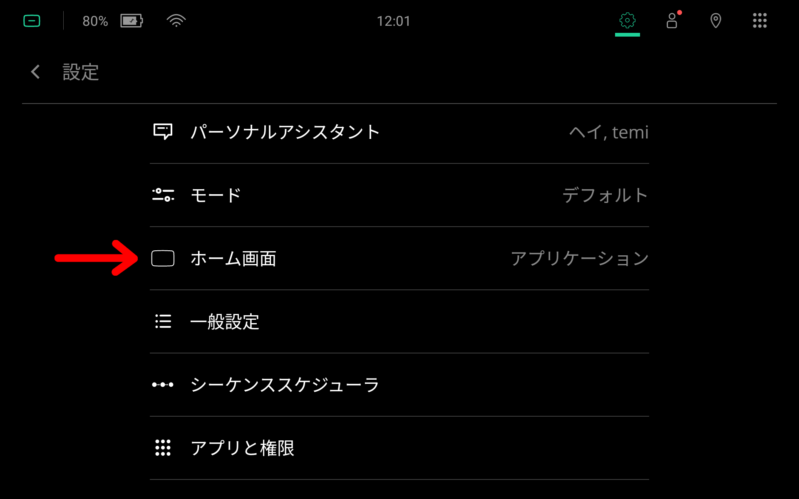
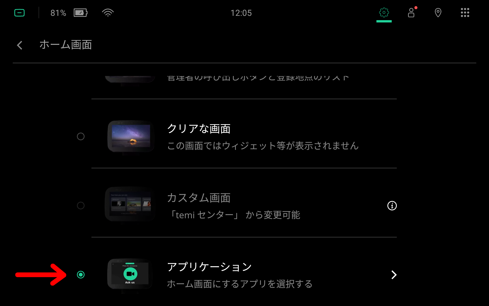

**********
Kiosk Mode
**********

Launching a native Android application at start up and keeping it on your Home Screen is known as *Kiosk Mode*.

The following instructions are for Launcher version 15029:

  Go to the ``Settings`` menu and tap on ``Home Screen``.

  Then tap on ``Application``. Make sure the radio button is selected.

  Finally, tap on the application you wish to use as your Home Screen.

Now return to your Home Screen and instead of the default desktop, you should see the selected Android application activity screen.

You should see a pull-down bar at the top of the screen. This can be used to gain access to temi's ActionBar.

  temi's pull-down bar. By pulling down on this, the user can reveal temi's ActionBar.

  temi's ActionBar.

At this time, this feature cannot be removed or locked for standard off-the-shelf Android apps. However, it is possible to remove the ActionBar for custom Android applications that uses temi's SDK. For details, see :ref:`hide-actionbar-pull-down-bar`.
