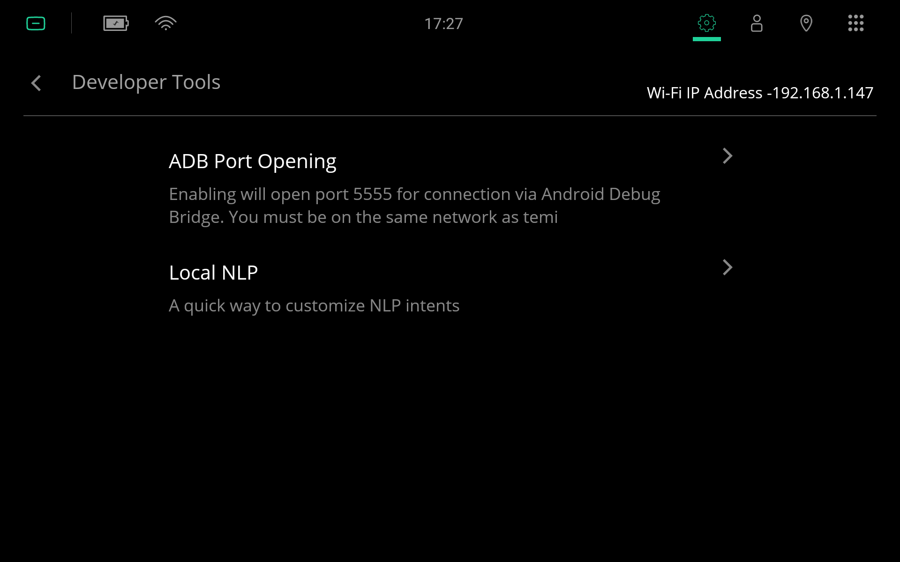

***
ADB
***
`Android Debug Bridge (ADB) <https://developer.android.com/studio/command-line/adb>`_ is a command-line tool that lets you communicate with Android devices, such as temi Robot.

Install ADB on Windows
======================

- Download `SDK Platform-Tools for Windows <https://developer.android.com/studio/releases/platform-tools>`_ and extract the downloaded zip file.

.. figure:: assets/images/adb/powershell-open.png
  :alt: Open PowerShell window menu

  Within the extracted folder, press ``SHIFT`` and ``right-click`` to display this menu. Select ``Open PowerShell window here`` (or ``Open command window here`` on some computers) to open a command prompt. A command prompt should appear.

Enable ADB Port on temi Robot
=============================
On the temi Robot, select ``Settings`` > ``Developer Tools`` and tap ``ADB Port Opening``. Take note of the robot's IP address in the top-right corner.

.. Caution::
  
  Enabling temi's ADB port posses some risks. For details, see :ref:`adb-security`.

Test ADB
========

- Connect your PC (with the installation of ADB) to the same network as the robot.
- Type the following command into the command prompt

.. code-block:: Shell

  adb connect <robot-ip-address>

.. figure:: assets/images/adb/powershell-adb.png
  :alt: Connect to the robot over ADB

  If everything goes well, you should see ``connected to <robot-ip-address>``.

Things You Can Do with ADB
==========================
There are an endless number of things you can do with ADB, see :ref:`adb-commands` for some examples.
