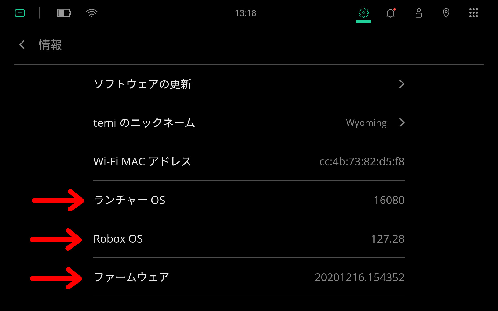
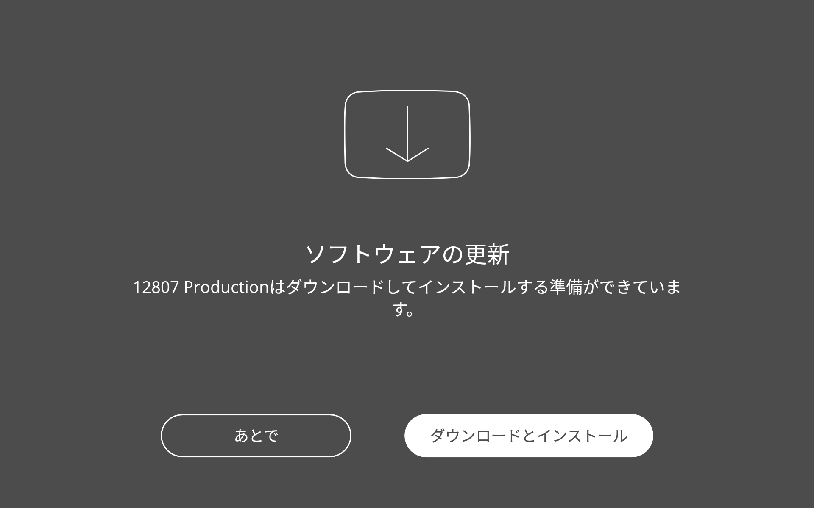
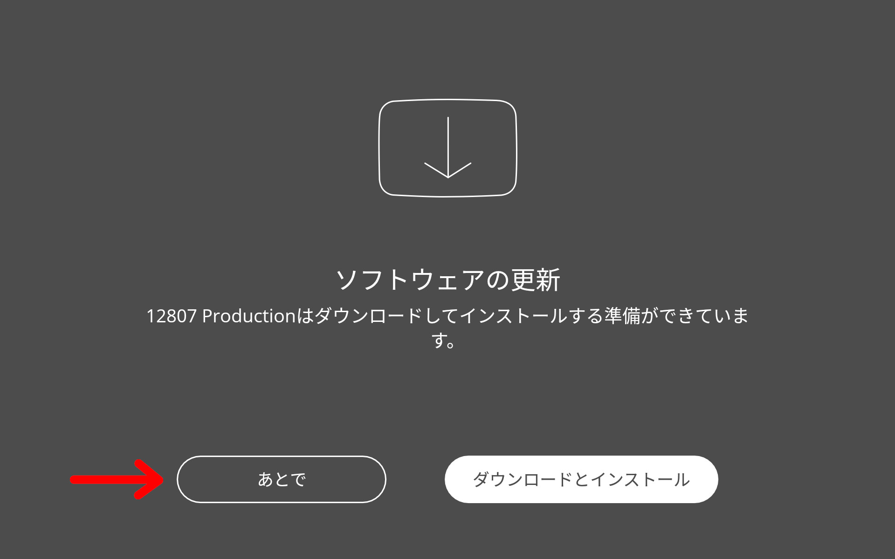
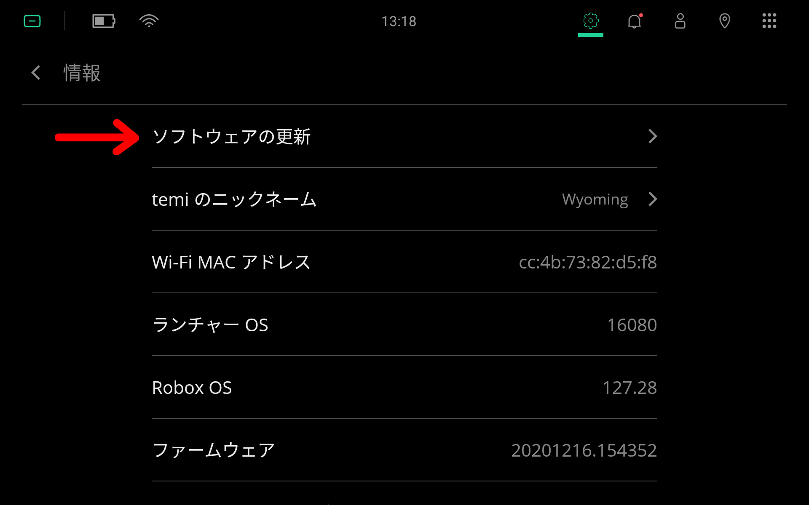
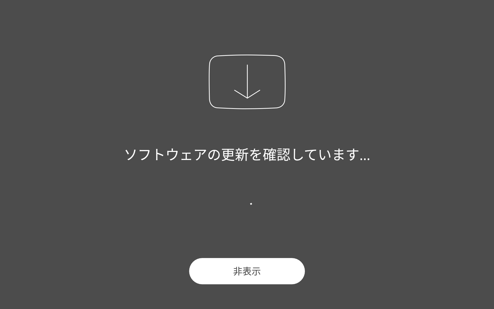
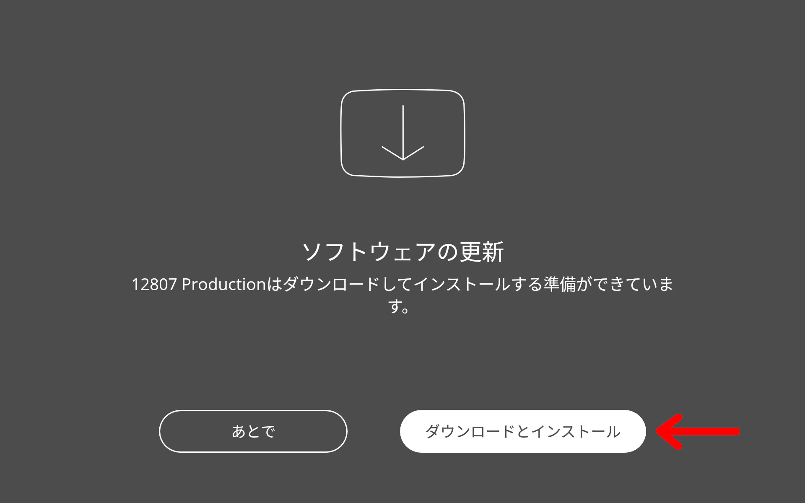
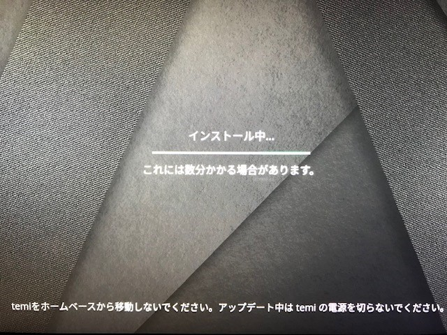
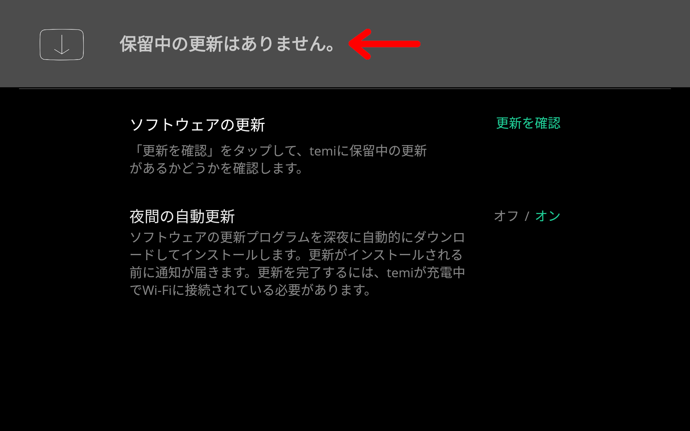
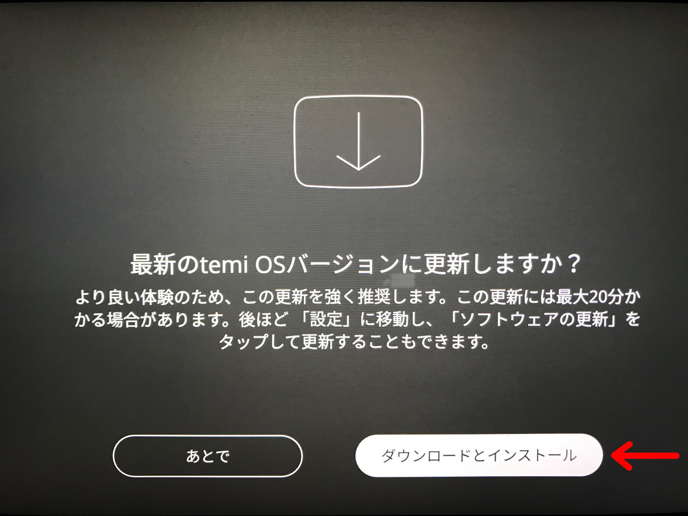

***************
Software Update
***************

.. Note:: The following information was validated on May 9, 2022 using Launcher OS 16080.

Check Software Version
======================
To check the robot's current software version, go to :guilabel:`Settings` > :guilabel:`About`.

  In the :guilabel:`Settings` > :guilabel:`About` screen, you will see 3 software versions: ``Launcher OS``, ``Robox OS``, and ``Firmware``.

+-----------------+--------------------------------------------+
| **Launcher OS** | Tablet Android launcher software version.  |
+-----------------+--------------------------------------------+
| **Robox OS**    | Navigation computer's software version.    |
+-----------------+--------------------------------------------+
| **Firmware**    | Tablet operating system's software version.|
+-----------------+--------------------------------------------+

For the most updated software version numbers, please refer to the Software Release Notes, which can be found on the `temi Support <https://www.robotemi.jp/support/>`_ page.

.. _OTA:

Over-the-Air Updates (OTA)
==========================
When temi releases a software update, the default behaviour of the robot will be to automatically update itself overnight. When the update is received, the robot will display a `Software Update` notification screen.

  When a software update is available, the robot will display a notification screen.

The update process may generally take up to 20 minutes (depending on the speed of the internet connection) and the robot will restart itself when the update has completed. Robot settings such as Wi-Fi configurations will be preserved across software updates and should not require user interaction.

.. DANGER:: Robot should remain on the Home Base during the software update. Do not attempt to turn-off the robot during a software update. If the software update is taking longer than expected, contact customer support.

.. TIP:: Software updates are not required, but strongly recommended. Failure to update temi Robot software may result in loss of features. 

In the event that a Software Update notification is not displayed, the user can `Manually Check for Software Updates`_. 

First Time Activation
=====================
We recommend the following steps for users receiving a Software Update notification after activating a robot for the first time.

#. Cancel the software update by selecting :guilabel:`Later` (see figure below)
#. `Check Software Version`_
#. `Manually Check for Software Updates`_

Repeat the update process until the software version is up-to-date.

  Cancel the software update by selecting :guilabel:`Later`.

Manually Check for Software Updates
===================================

  Select :guilabel:`Settings` > :guilabel:`About` > :guilabel:`Software Update`.

  The robot will start searching for available software updates.

  If a software update is available, the user can select :guilabel:`Download & Install` to start the software update.

  A robot may generally take up to 20 minutes to download and install a new update (depending on the speed of the internet connection).

After the software installation is complete, `Check Software Version`_. Repeat this process until the software version is up to date. If a software update is unavailable, go to section `Software Update Unavailable`_.

.. Robox OS 114 or Earlier
.. =======================
.. All robots with Robox OS 114 or earlier need to be updated in stages. If you have a robot with Robox OS 114 or earlier, contact customer support and be ready to provide the following information (which can be found in :guilabel:`Settings` > :guilabel:`About`):

.. - temi Robot serial number
.. - Launcher OS version
.. - Robox OS version

.. The robot will be updated in 2 stages and will be require the user's participation in the installation process.

.. First, temi will manually push the **first-stage** software update via OTA_ to the robot.

.. .. figure:: assets/images/software-update/confirm-update-pushed.jpg
..   :alt: Software Update notifcation when temi manually pushes an update to a specified robot.

..   Once the software update has been pushed to the robot, a notification will appear on the robot's screen. Select :guilabel:`Download & Install` to proceed with the software update.

.. After the software installation is complete, notify customer support with the software version numbers (see `Check Software Version`_). temi will then push the **second-stage** software update via OTA_ to the robot. Repeat the download-installation process again.

.. After the software installation is complete, `Check Software Version`_ to make sure the robot is on the most recent software release.

Software Update Unavailable
===========================

If no software updates are available, contact customer support and be ready to provide the following information (which can be found in :guilabel:`Settings` > :guilabel:`About`):

- temi Robot serial number
- Launcher OS version
- Robox OS version

temi will push the software update via OTA_ to the robot.

  Once the software update has been pushed to the robot, this notification will appear on the robot's screen. Select :guilabel:`Download & Install` to proceed with the software update.

After the software installation is complete, `Check Software Version`_ to make sure it is on the most recent software release.

