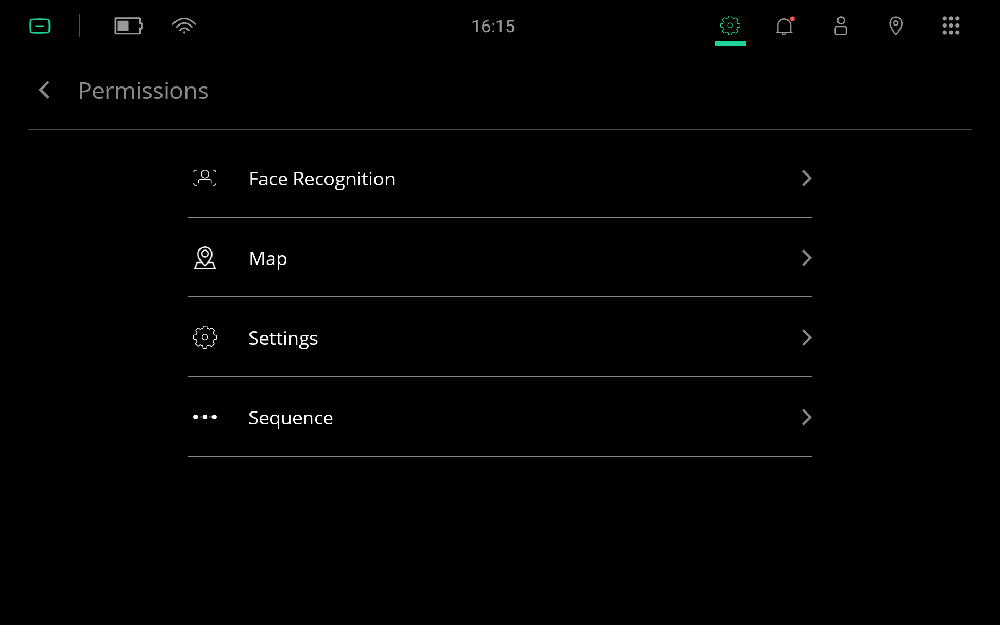

***********
Permissions
***********

Permissions must be enabled for certain features to work. There are 4 types of permissions: (1) Face Recognition, (2) Map, (3) Settings, and (4) Sequence.

How To
======
Add the following ``meta-data`` tag so that you can configure the app's permissions through temi's launcher.

.. code-block:: xml

  <application>
    ...
    <meta-data
      android:name="@string/metadata_permissions"
      android:value="com.robotemi.permission.settings" />
    ...
  </application>

To request multiple permissions, append and separate them with a comma (,).

.. code-block:: xml

  <application>
    ...
    <meta-data
      android:name="@string/metadata_permissions"
      android:value="com.robotemi.permission.face_recognition,
                     com.robotemi.permission.map,
                     com.robotemi.permission.settings,
                     com.robotemi.permission.sequence" />
    ...
  </application>

Then in ``Settings`` > ``Apps`` > ``Permissions`` menu, select the appropriate permission and enable the permission in your app. 

  temi's Settings permissions page (Launcher OS 14759).

References
==========
* `temi SDK: Permissions <https://github.com/robotemi/sdk/wiki/permission>`_
