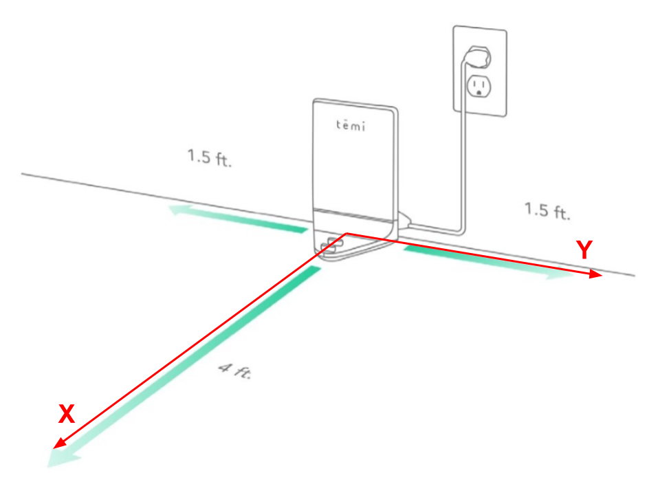

**************
Set Robot Pose
**************

The temi SDK allows the developer to send the robot to an arbitrary location on a saved map.

For example, to send the robot to 1 m in front of the Home Base, use the following code after the robot is :ref:`ready <sdk-robot-ready>`.

.. code-block:: Java

  float posX = 1.0; // [m]
  float posY = 0.0; // [m]
  float yaw = 0.0; // [deg]
  int tilt = 0; // [deg]

  Position pose = new Position(posX, posY, yaw, tilt);
  Robot.getInstance().goToPosition(pose);

Coordinate Reference Frame
==========================
The robot's Home Base represents the origin of the coordinate reference frame. The orientation of this frame is shown in the figure below.

goToPosition()
--------------
Go to a position on the map.

Syntax
++++++
.. code-block:: Java

  goToPosition(position);

:position: :ref:`sdk-class-position` instance. Note that the tilt attribute is not used.

.. _sdk-class-position:

Position
--------
Position class can be used to instantiate an object that holds the robot pose information.

Syntax
++++++
.. code-block:: Java

  Position pose = new Position(posX, posY, yaw, tilt);

:posX: Position along the X-coordinate frame in meters.
:posY: Position along the Y-coordinate frame in meters.
:yaw: Yaw rotation in degrees.
:tilt: Robot's screen tilt angle in degrees. This value ranges between -25 degrees (screen tilted downwards) to +55 degrees (screen tilted upwards).

Example
=======
* `Go to Position <https://github.com/hapi-robo/temi-guide/tree/master/examples/set-robot-pose>`_

References
==========
* `temi SDK: Navigation & Map: <https://github.com/robotemi/sdk/wiki/Locations#navigation--map>`_
