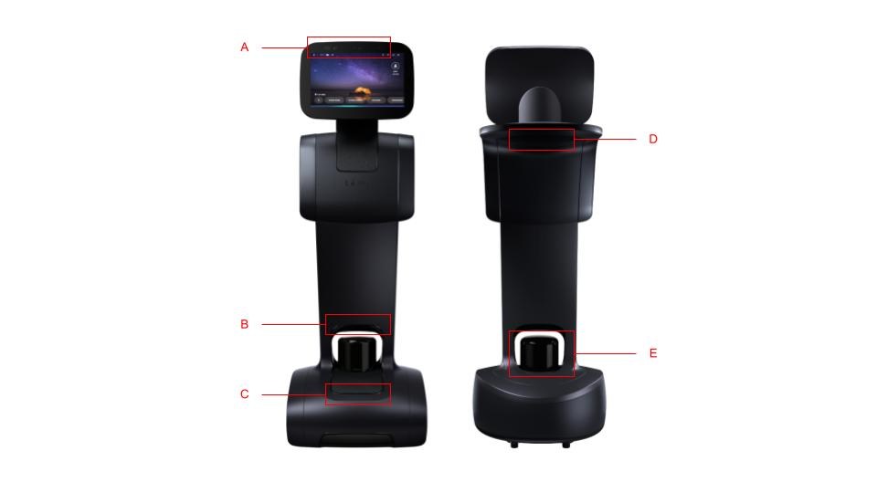
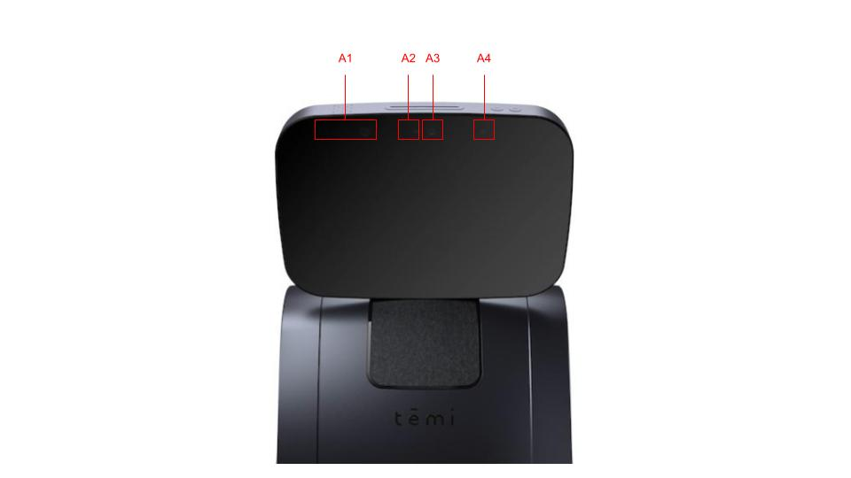

******************
Navigation Sensors
******************

The robot comes equipped with a suite of optical sensors that are used for navigation. As with all optical sensors, environmental lighting, as well as surface reflection, transmission, and absorption affect what the sensors are able to detect. In turn, these can affect navigation performance.

.. Important::
  Ensure that the sensors are free of dust, fingerprints, or any occlusion. A micro-fiber cloth and/or compressed air duster can be used to clean the sensors.

  Robot sensors: (A) Head sensors (see below for details), (B) ground camera (or depth camera), (C) front ToF sensors, (D) rear ToF sensors, (E) LIDAR.
 

  Head sensors: (A1) head (or depth sensor), (A2) camera, (A3) wide-angle camera, (A4) RGB camera. 

LIDAR
=====
The primary navigation sensor is the laser, imaging, detection, and ranging (`LIDAR <https://en.wikipedia.org/wiki/Lidar>`_) sensor. It is used for mapping the environment and it assists with detecting obstacles.

.. @TODO Multiple versions of the LIDAR

Depth Camera
============
The robot has 2 depth cameras. One embedded into the tablet and pointing in the direction of the tablet, and one just above the LIDAR pointing forwards towards the ground:

- **Tablet Camera**: This is used to assist with tracking people.  
- **Ground Camera**: This is used to detect obstacles directly in front of the robot on the floor.

.. @TODO Multiple versions of the Depth Camera

ToF Sensors
===========
The robot has 2 sets of Time-of-Flight (ToF) sensors. Three in the front pointing upwards, and three on the back (under the tray) pointing downwards:

- **Front Sensors**: These are used to detects obstacles, such as tables directly in front of the robot.
- **Back Sensors**: These are used to detect *cliffs*, e.g. stairs, escalators, genkan, etc. directly behind the robot when moving backwards.

.. Tip:: Do not rely on the depth cameras or the ToF sensors. From our tests they do not work reliably. We recommend reducing their use (e.g. lower the obstacle avoidance sensitivity or turn them off completely), and to use virtual walls in the map.
