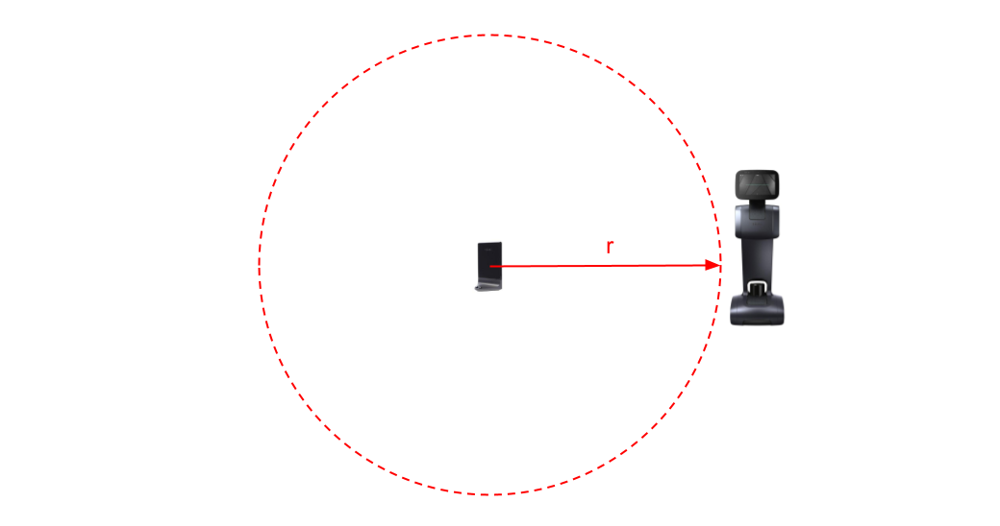
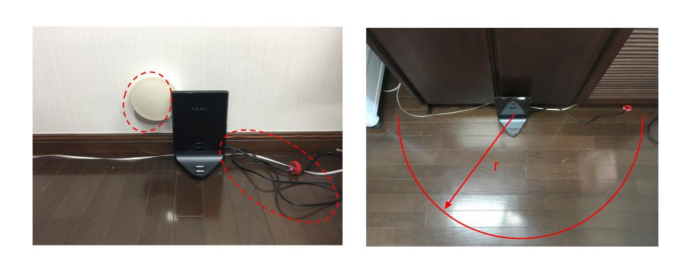
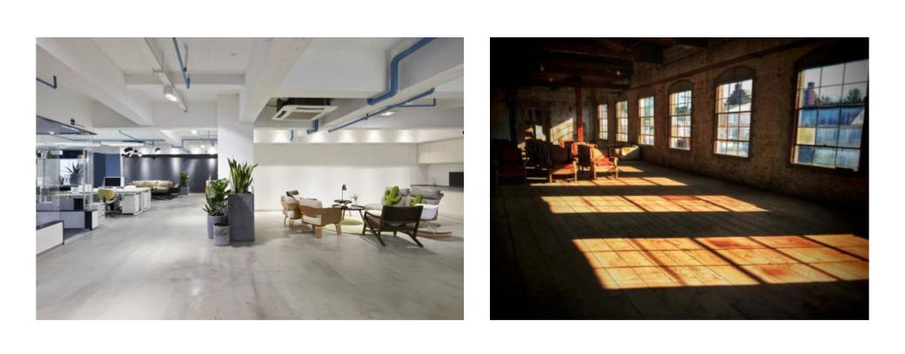
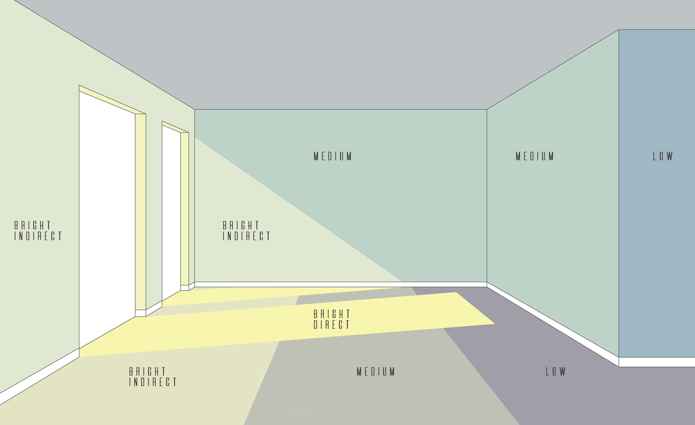
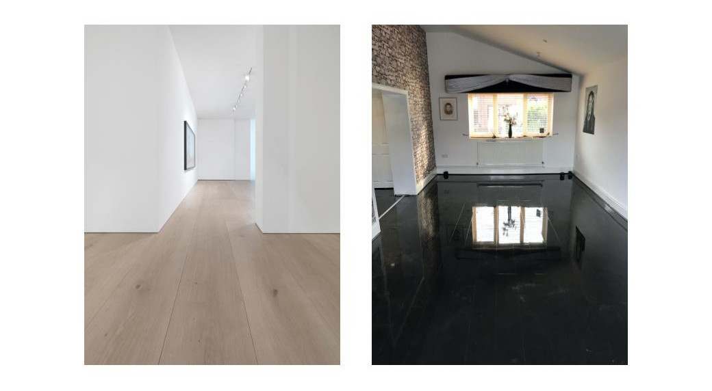
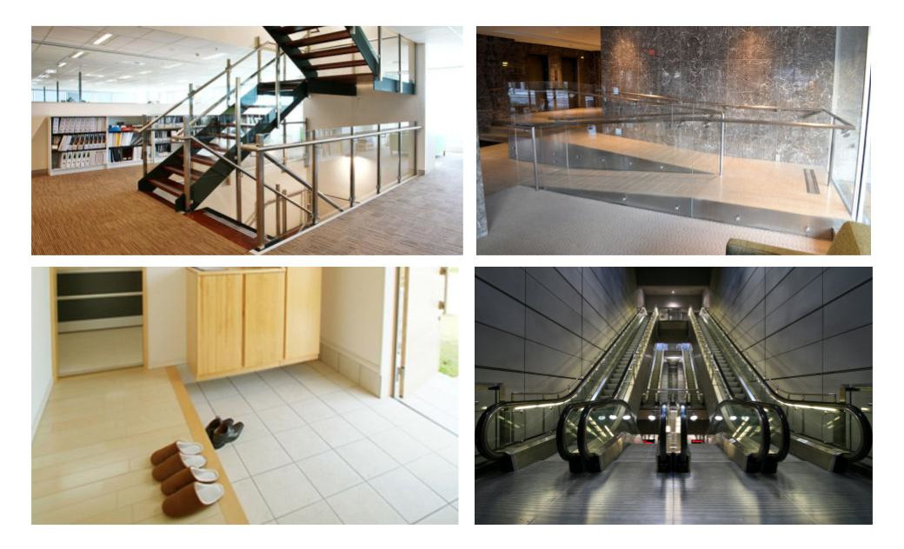
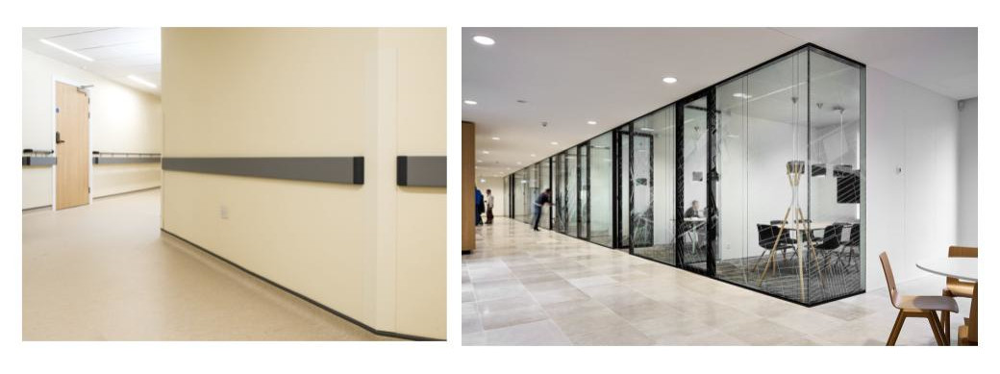
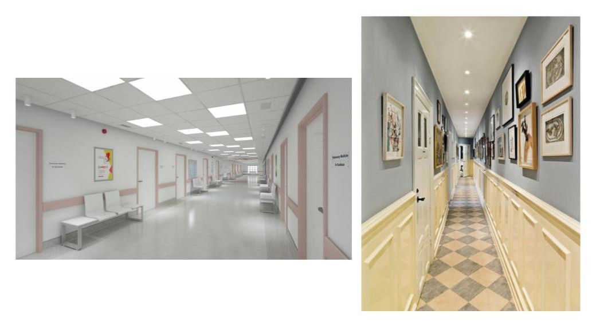
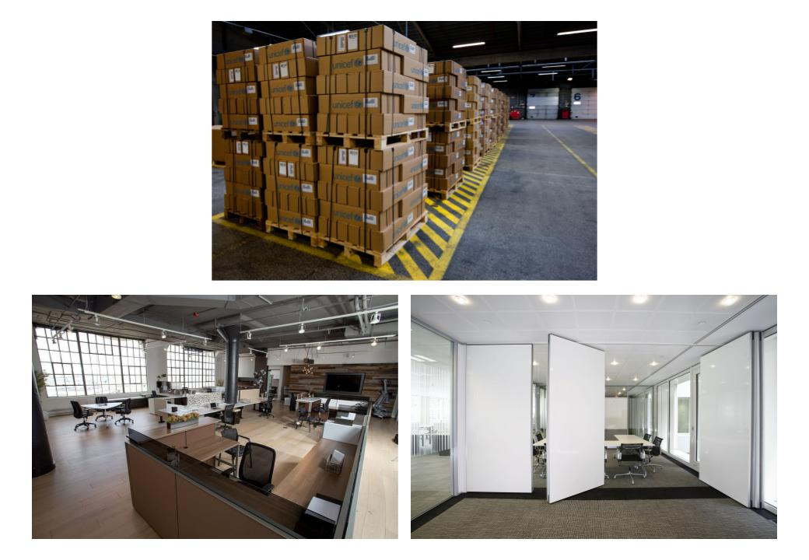

.. https://hapirobo.sharepoint.com/:p:/r/sites/hapi-robo/_layouts/15/doc2.aspx?sourcedoc=%7BAD7095C6-2BCE-4C3C-BFF1-008F86060057%7D&file=Temi%20Best%20Practices%20(2020.11.17).pptx&action=edit&mobileredirect=true

***********
Environment
***********

The following is a list of ideal conditions that should ensure reliable navigation.

.. _navigation-environment-operating-area:

Operating Area 
==============

  The map should not be more than 50 m radius (``r``) from the Home Base. In comparison to a small area, a large are will require more memory and computational power. This generally will result in lower navigation performance.

  The Home Base should be placed against a flat wall/surface, and a 50 cm radius (``r``) around the Home Base should be free of obstacles.

Lighting
========

  Due to its use of optical sensors, it is best to use the robot in environments with artificial light (left). It is preferable to avoid area of bright direct sunlight (right). For more details, see below.

  Avoid using the robot in areas of bright direct sunlight. High intensity light can blind the robot's sensors, resulting in poor navigation performance.

Floor
=====

  Floors should be of a light color, non-reflective, and solid (left). Dark colored,  reflective, and/or transparent floors (right) can confuse the robot's optical sensors, resulting in poor navigation performance.

  Environments with *cliffs*, such as stairs (top-left), escalators (bottom-right), genkans (bottom-left), etc. are *not* recommended. Ramps with an incline of more than 3 degrees (top-right) should be avoided. If the robot is to be used in such environments, it is strongly recommended to add a ``virtual wall`` around the cliffs in the map.

Walls
=====

  Walls should be of a light color, non-reflective, and solid (left). Dark colored,  reflective, and/or transparent walls (right) can confuse the robot's optical sensors, resulting in poor navigation performance.

  Give penty of room for the robot to navigate (left). Narrow corridors (right) will lower navigation performance. We recommend that the minimum width (for corridors, doorways, etc.) be at least 100 cm.

Dynamic Environments
====================

  Warehouse environments where pallets may be in a location one day and gone the next, open-office spaces where tables and chairs can move freely, environments with sliding/movable wall partitions, etc. all require careful planning for robot navigation to work reliably. In these environments, it is recommended to use :ref:`navigation-map-green-paths` and :ref:`navigation-map-virtual-walls` to define the where a robot can and cannot go. For more details, see :doc:`05_map`.

.. @TODO Featureless Environments 