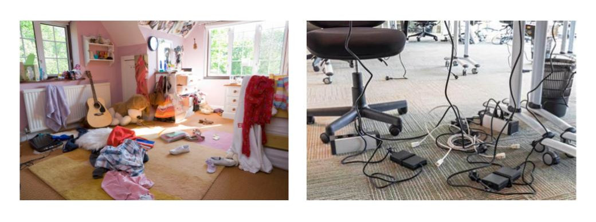
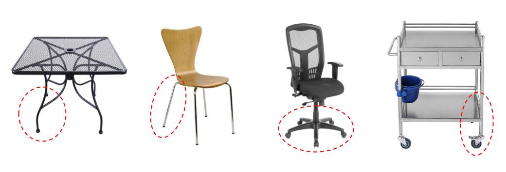
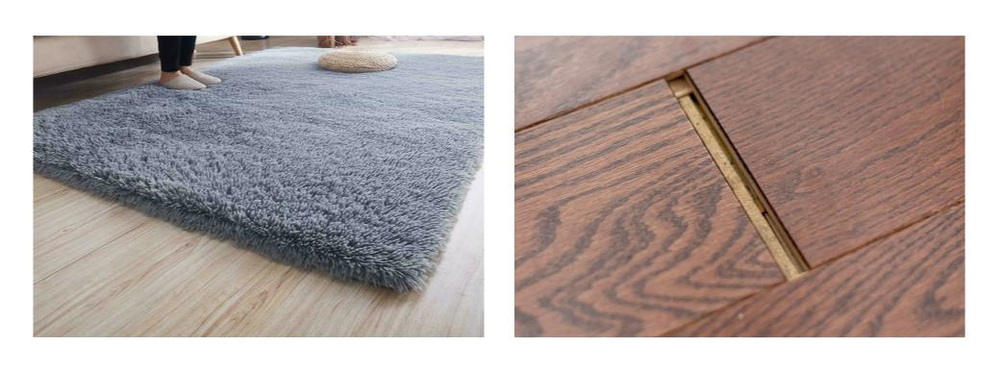
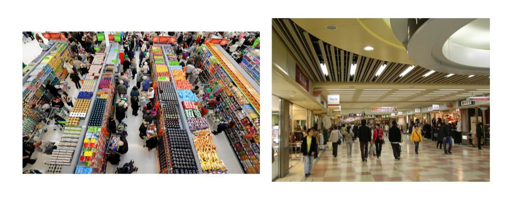
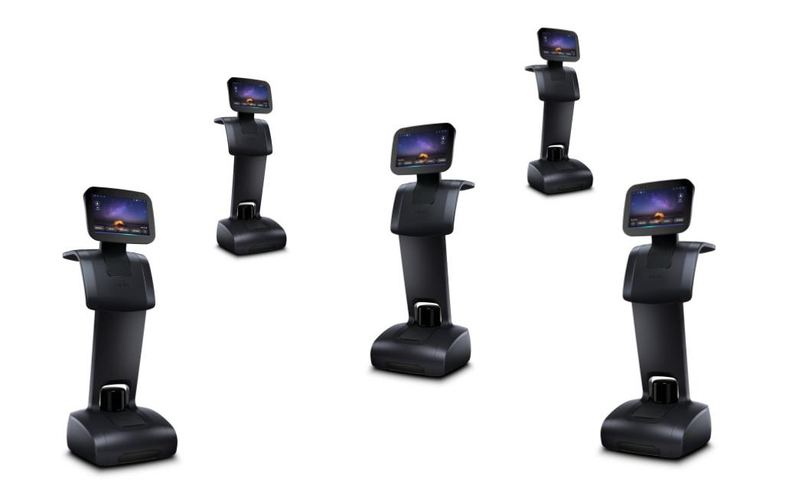

*********
Obstacles
*********
It is recommended that the robot operate in environments with few moving obstacles. Environments where there are many people and/or objects that moving about can result in poor navigation performance.

Small Objects
=============

  Operating in cluttered environments (left) is not recommended. Objects with a height lower than 22 cm (LIDAR height) (right) will not be detected by temi.

Chairs & Tables
===============

  Objects with a legs, such as chairs and tables, will cannot reliably be detected. In environments with these obstacles, it is recommended to draw a ``virtual wall`` around them. In general, objects with a diameter of less than 7 cm will not reliably be detected.

Uneven Floors
=============

  Avoid uneven floors. The robot cannot drive over obstacles that are more than 5 mm in height, e.g. thick carpet, gaps in the floor, etc.

Crowded Spaces
==============

  Do not expect the robot to smoothly navigate crowded spaces. Even in large areas, where it might seem appropriate to use the robot when empty, may not be appropriate when full of people. Plan appropriately.

Robots
======

  The temi Robot cannot detect other robots. Using multiple robots in the same environment may result in collisions.
