.. https://docs.google.com/presentation/d/1iKjgBhx9mxDqpwMDOSewekEN6iDiLzqD/edit#slide=id.gf94671f9e6_1_68

**************
Creating a Map
**************

For the robot to navigate reliably, it is very important to build a good quality map.

Occupany Grid
=============
The map that is shown in the robot's ``Settings`` > ``Map`` menu and in temi Center is what is called an `Occupany Grid <https://en.wikipedia.org/wiki/Occupancy_grid_mapping>`_. Each pixel in the map represents the probabiliy of an obstacle at that location as seen by the LIDAR.

- Dark-colored pixels (black) represent high-probability of an obstacle
- Light-colored pixel (white) represent low-probability of an obstacle

Good vs. Bad Map
----------------
A good map is an occupancy grid that accurately represents the real world. Sometimes, passing over an area once isn't enough. 

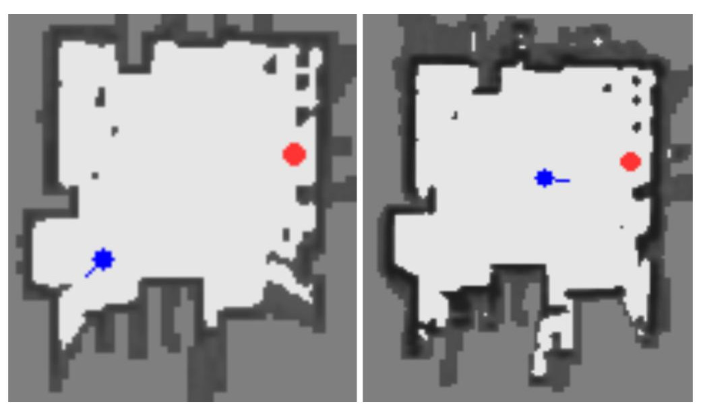

  These images show the occupancy grid of the same environment. The left image shows the map after a quick single pass of the environment. The right image shows the map after multiple slow passes around the environment. Notice that the walls (or ``features``) are darker. In this case, the right image is the better map.

Features
========

Natural
-------
Dark-colored pixels are what we refer to as `natural features`, and they are what helps the robot to estimate its location in the map. Without `natrual features`, the robot would be lost. Therefore, for reliable navigation it is important to have lots of features in the map.

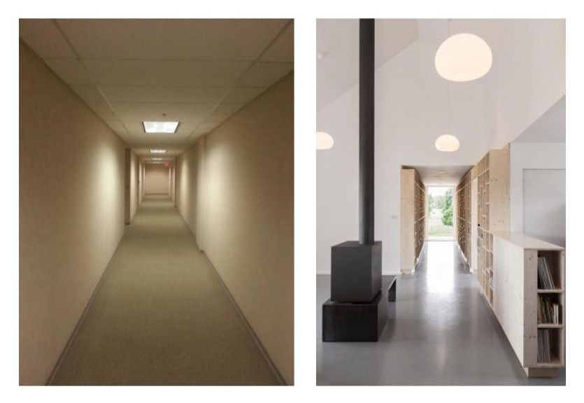

  The left image shows a featureless corridor. The right image shows a corridor with many features, e.g. bookshelf, column, etc. The robot will more reliably navigate the corridor shown in the right image.

Artificial
----------

.. _navigation-map-virtual-walls:

Virtual Walls
+++++++++++++
Virtual walls can be created directly with the robot or in temi Center.

Virtual walls should be used to block off areas that are not clearly shown in the map, e.g. chairs, glass walls, tables, stairs, escalators, genkan, ramps, etc. They should also be used to areas that you don't want the robot to go.

Use virtual walls to also block off areas that have not been mapped (map edges) to reduce path planning time.

In open dynamic environments, we recommend building a `virtual corridor` using virtual walls to keep the robot from moving too far off course.

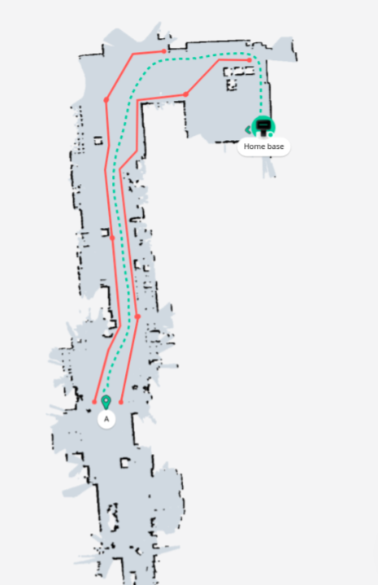

  This is an example of a large open dynamic environment. In this case, it was better to use virtual walls to create a virtual corridor for the robot to reliably navigate.

.. _navigation-map-green-paths:

Green-Paths
+++++++++++
Green paths can be created directly with the robot and/or in temi Center. We recommend doing this in temi Center after virtual walls and locations have been defined.

Adding green-paths can reduce path-planning time and in general improve navigation reliability. We recommend drawing green-paths between each location.

General Recommendations
=======================
- **Start small.** Start with a small area (e.g. 50 m\ :sup:`2`), and as you become more comfortable with the robot's ability to navigate, increase the area. Keep in mind the :ref:`navigation-environment-operating-area`.
- **Move slowly.** Maintain a distance of approximately 1.0 - 1.5 m with the robot following you around the environment during mapping. Watch the map on the screen as it's being built. Make sure it correctly captures all the features. Go around the area again and/or walk-in a circle to capture as many features as possible. 
- **Loop closure.** Avoid building maps that are just straight lines, e.g. hallway, a single shopping aisle, etc. Map generation works best when the robot is led around the environment in a loop and is allowed to revisit the same locations from different trajectories.
- **Green-paths and virtual walls.** Use :ref:`_navigation-map-virtual-walls` to constrain the robot's operating environment, and use :ref:`navigation-map-green-paths` to assist the robot with finding the best route to a location.

General Process
===============

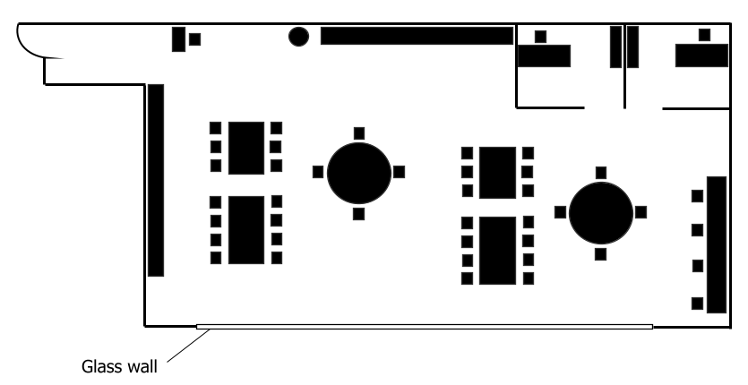

  The map that the robot creates should look similar to its physical layout.

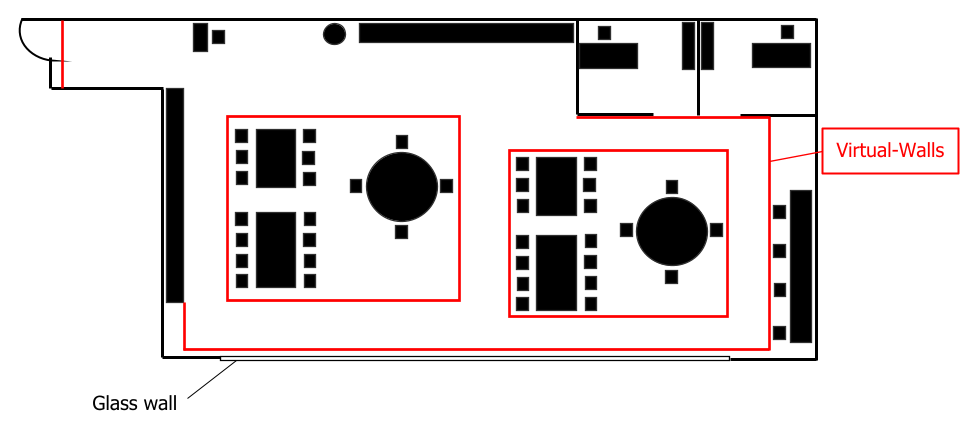

  Close off any areas with virtual walls that were not correctly seen by the robot, e.g. glass walls, stairs, etc. Add virtual walls to prevent the robot from going to places it does not need to go or to prevent from considering such paths in its calculations. 

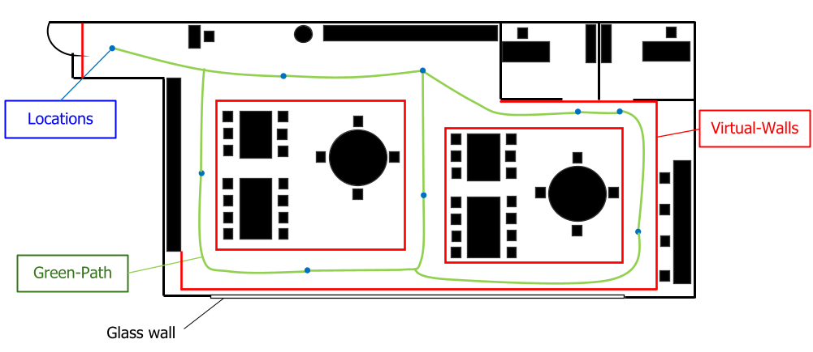

  Add locations to the map. Then add green paths to provide the robot with recommended navigation routes, e.g. shortest route, routes with the fewest obstacles, etc.

Examples
========
The following are some examples of real-world maps, issues and recommendations.

Scenario A
----------

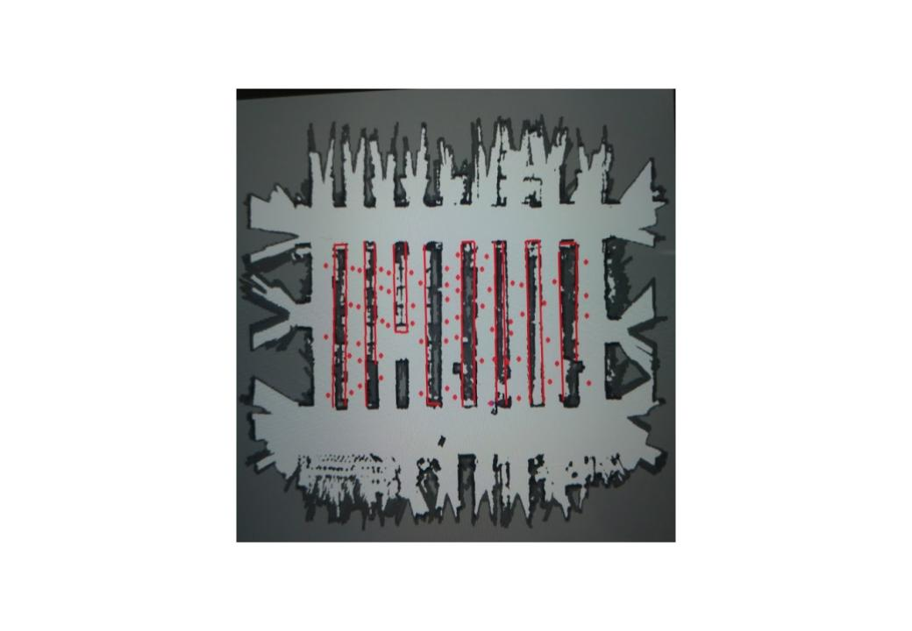

  This is the original map. Notice that some locations are in the virtual walls. There is no green-path. The environment is also not bounded, leading to large path-planning times.

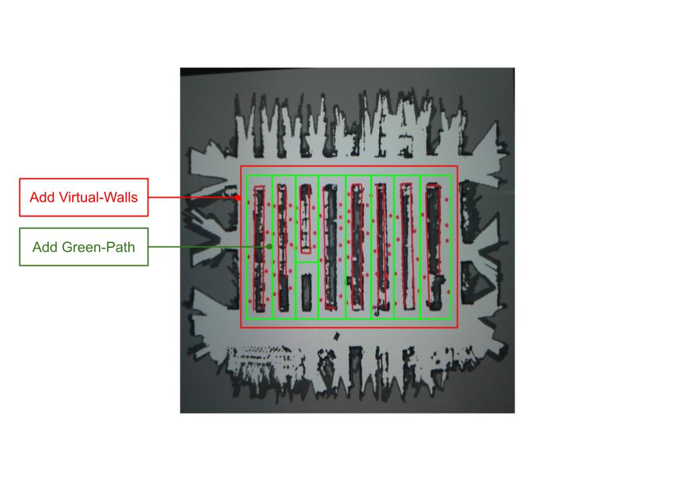

  Recommendations: Bound the environment with virtual walls and add green paths.

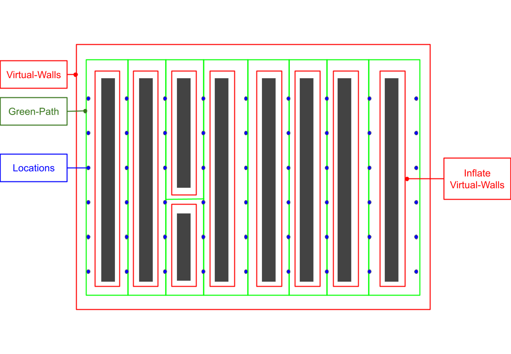

  All artificial features (i.e. locations, virtual walls, and green-paths) can be added quickly with temi Center.

Scenario B
----------

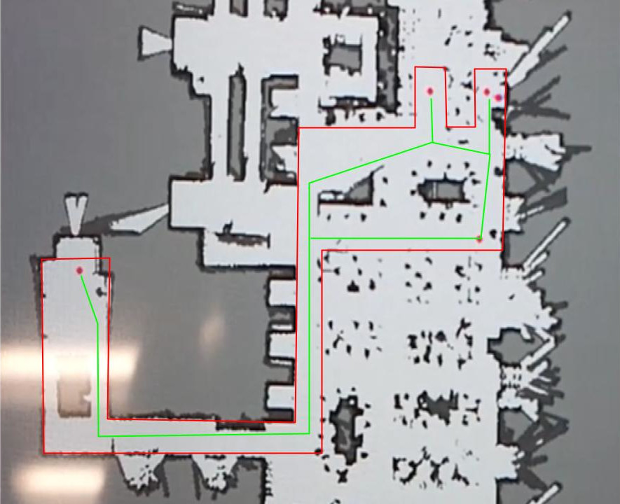

  Open office space with lots of tables and chairs that can be moved around. Used virtual walls to define a `virtual corridor` for the robot to operate in and defined green-paths to assist with path-planning.

Scenario C
----------

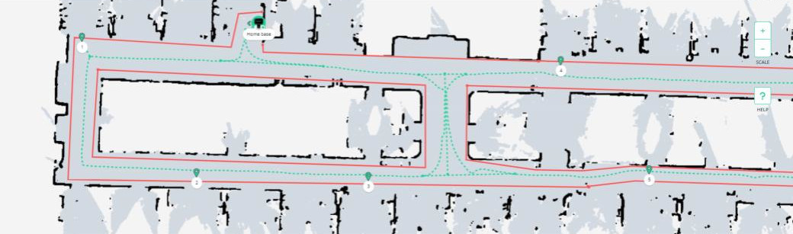

  Long corridor with many rooms that are not clearly mapped out. Used virtual walls to define a `virtual corridor` for the robot to operate in and defined green-paths to assist with path-planning.
