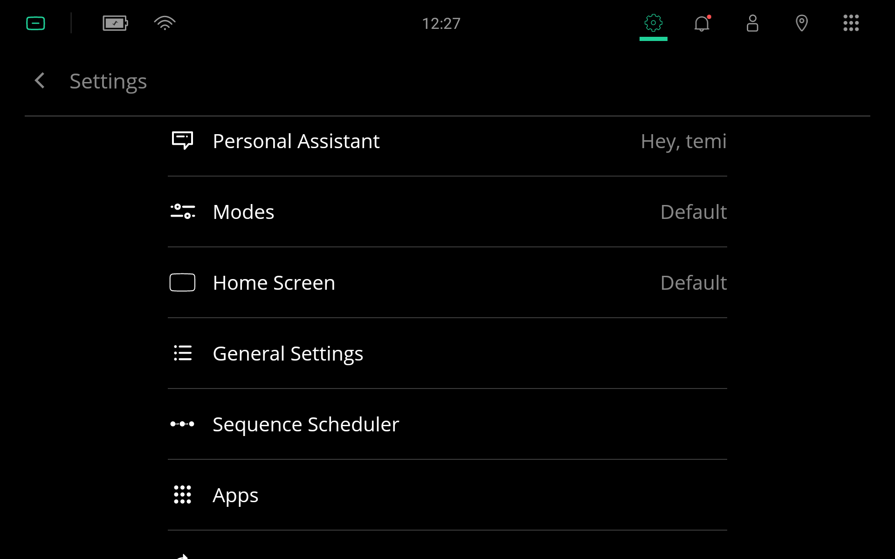
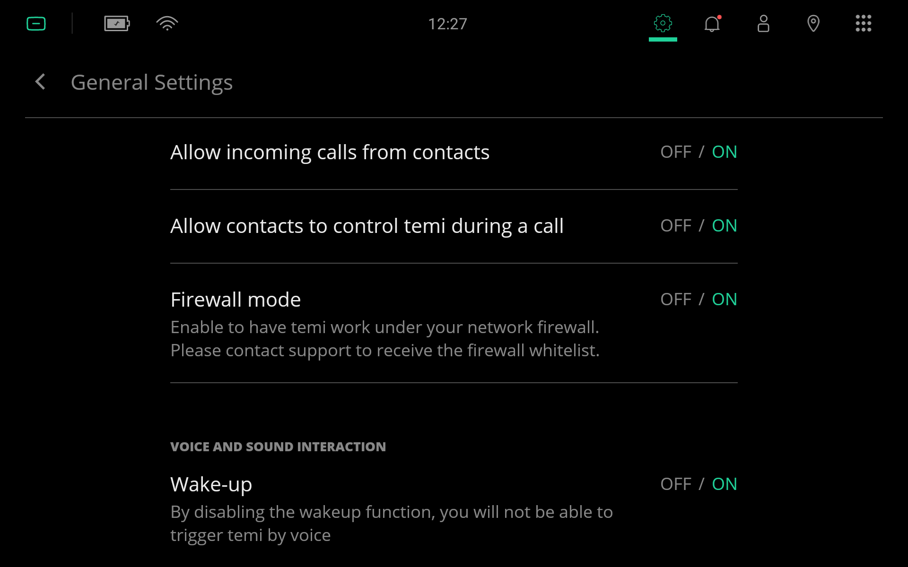
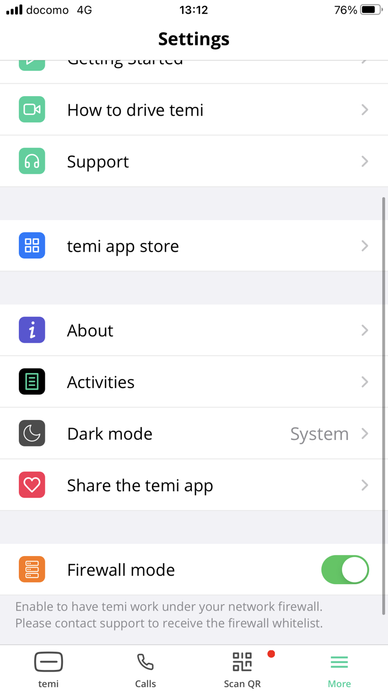
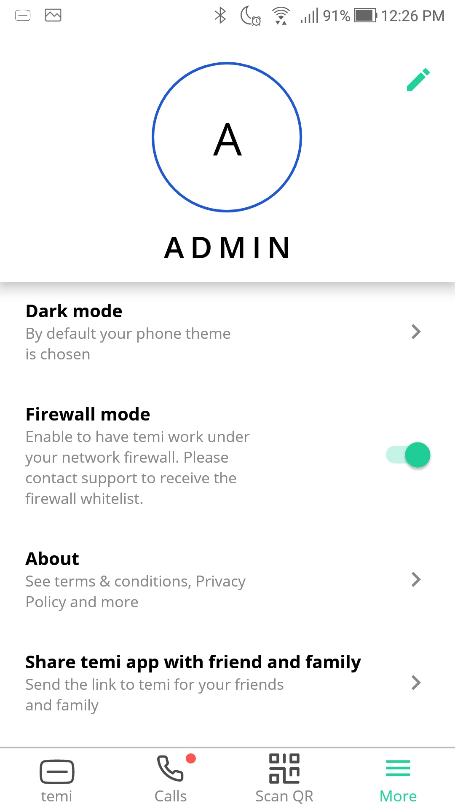
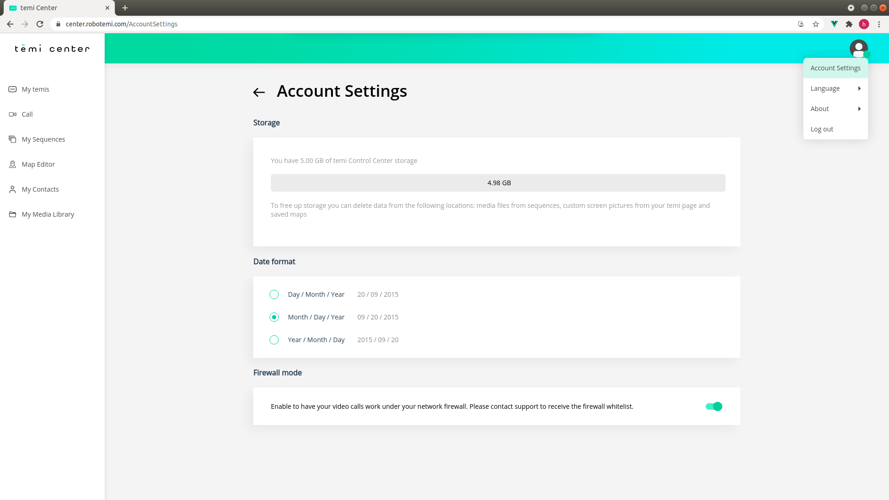

.. https://hapirobo.sharepoint.com/:x:/r/sites/hapi-robo/_layouts/15/doc2.aspx?sourcedoc=%7B9F4CB8A6-E544-410E-B1EF-AB44A5743DFB%7D&file=temi_firewall_settings.xlsx&action=default&mobileredirect=true&cid=eab50f22-0111-4f91-aefb-967ccfbe6f33

*************************
Firewall & Proxy Settings
*************************

.. _firewall-settings:

Firewall Settings
=================

A list of the IP/FQDNs and port numbers that are used by temi Robots, temi Mobile App, and temi Center are provided in the following CSV file. For changes to previous versions, see :ref:`firewall-changelogs`.

:download:`Firewall Settings (2022/02/09) <assets/temi_firewall_settings_20220209.csv>`

.. https://docs-preprod.agora.io/en/Video/cloud_proxy_na?platform=Android
.. SLA: https://docs.agora.io/en/Agora%20Platform/agora_platform?platform=All%20Platforms
.. Support Plans: https://www.agora.io/en/pricing/support-plans/

Whitelist only those IP/FQDNs and port numbers that you want to use. 

.. admonition:: Recommendations

  The last column labeled ``Recommended``, in the CSV file, provides the minimum set needed for establishing telepresence sessions and OTA software updates.

The latest firewall settings have been tested on the following software versions using a `Netgate 1100 Security Gateway <https://docs.netgate.com/pfsense/en/latest/solutions/sg-1100/>`_ running `pfSense 21.02.2 <https://www.pfsense.org/>`_.

+---------------------------+------------+
|                           | Version    |
+===========================+============+
| temi Robot (Launcher)     | 15567      |
+---------------------------+------------+
| temi Mobile App (Android) | 1.3.8526   |
+---------------------------+------------+
| temi Mobile App (iOS)     | 1.1.49     |
+---------------------------+------------+

Enabling Firewall
-----------------

If a firewall is used, you must enable this mode on your device(s). The instructions for each device can be found in the following sections.

temi Robot
^^^^^^^^^^
Under ``Settings`` > ``General Settings``, turn ``ON`` `Firewall Mode`.

  Tap on ``General Settings`` in the ``Settings`` menu to bring up the General Settings menu. `[Image taken from Launcher OS 14759]`

  Turn ``ON`` `Firewall Mode`. `[Image taken from Launcher OS 14759]`

temi Mobile App
^^^^^^^^^^^^^^^

iOS
"""

  Tap on ``More`` to bring up the Settings page. Then turn ``ON`` `Firewall Mode`. `[Image taken from iOS mobile app 1.1.45]`

Android
"""""""

  Tap on ``More`` to bring up the Settings page. Then turn ``ON`` `Firewall Mode`. `[Image taken from Android mobile app 1.3.8425]`

temi Center
^^^^^^^^^^^

  Hover over the user icon in the top right-hand corner and tap ``Account Settings`` to bring up the Account Settings page. Then enable `Firewall Mode`. `[Image taken from temi Center 2021/07/14]`

.. _proxy-settings:

Proxy Settings
==============
temi Center uses WebSockets for establishing video connection and for controlling the robot remotely. Therefore, proxy servers should be configured to allow for WebSocket connections. The :ref:`firewall-settings` document at the top of this page has a column labelled ``WebSockets`` that indicates which FQDN/IPs and ports use WebSockets.

Troubleshooting
===============
After configuring your network with the settings described above, if you are still not able to use the temi Robot, temi Mobile App, and/or temi Center, please check the following:

Firewall Settings
-----------------
- Use the most recent firewall settings. The latest version is provided as a CSV file at the top of this page. 
- Do not convert FQDN addresses to IP addresses. FQDNs are used because the underlying IP addresses may change without notice.
- Connect a PC to your firewall-configured network and check if it is able to reach each of the FQDN/IPs listed in your firewall settings. Note that some domains block/drop ICMP packets (there is an ``ICMP Blocked`` column of the :ref:`firewall-settings` document), so `ping` cannot reliably be used to check this. In this case, one can use one of the following::

    nmap -sn center.robotemi.com
    host center.robotemi.com

Proxy Settings
--------------
Your proxy servers may not allow for WebSocket connections. You can test your WebSocket with `this <https://libwebsockets.org/testserver/>`_. If the WebSocket connection is working, you should see:

- You should see a number incrementing
- The number resets if you click on the ``Reset counter`` button

Web Browser
-----------
- Are you using the latest version of a supported web-browser?
- Do you have any additional web-browser security features (apart from the default set) enabled?
- Are microphone and video allowed to operate through the web-browser?
  
  - Test microphone: https://webcammictest.com/check-mic.html
  - Test video: https://webcammictest.com/

.. _firewall-changelogs:

Changelogs
==========
**temi_firewall_settings_20220209.csv**

- Removed duplicate ``s.youtube.com`` entry for YouTube Video Skill service

**temi_firewall_settings_20211104.csv**

- Added ``production-temi-resources-private-virginia.oss-us-east-1.aliyuncs.com`` to supported animated faces in temi Robot (Launcher) 15567

**temi_firewall_settings_20210927.csv**

- Removed duplicate host: ``eastus.tts.speech.microsoft.com``
- Added ``Notes`` field, and included some comments about text-to-speech services

**temi_firewall_settings_202109.csv**

- Added ``WebSockets`` field
- Added ``ICMP Blocked`` field

**temi_firewall_settings_202108.csv**

- Fixes a typo in row 29. Previously wrote port 444. It should be port 443.

**temi_firewall_settings_202107.csv**

- Initial release
