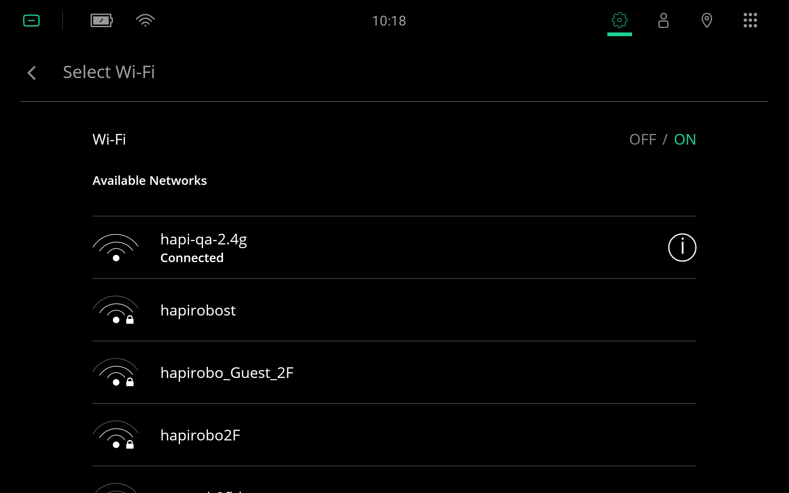
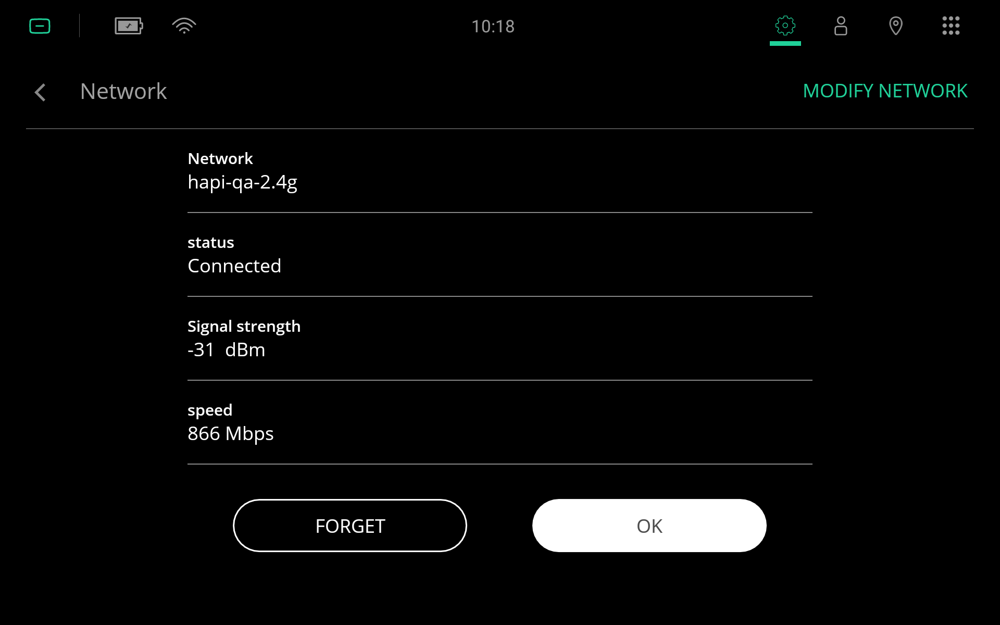

********
Appendix
********

.. _measuring-wifi-signal-strength:

Measuring Wi-Fi Signal Strength
===============================

.. Attention:: Wi-Fi signal strength must be measured using the wireless device that will be using Wi-Fi. For example, do not measure Wi-Fi signal strength using a smartphone when the Wi-Fi signal will be used by the robot. The antennas on the smartphone and robot are different, which will make the Wi-Fi signal strength measurements different.

Use the following instructions to measure Wi-Fi signal strength on the robot.

.. Important:: Remember to check the robot's Wi-Fi signal strength across its entire operating environment. Signal strength changes depending on where the robot is in the environment, and in general signal strength decreases the further you are away from the Wi-Fi access point.

  Tap on the Wi-Fi icon in the top left-hand corner to bring up the Wi-Fi network selection menu.

  Tap on the information icon on the right-hand side of the connected network to bring up the network settings page.

  Here you should see a line displaying the ``Signal strength`` in the units of `dBm`. This represents the Wi-Fi signal strength for the robot.

  