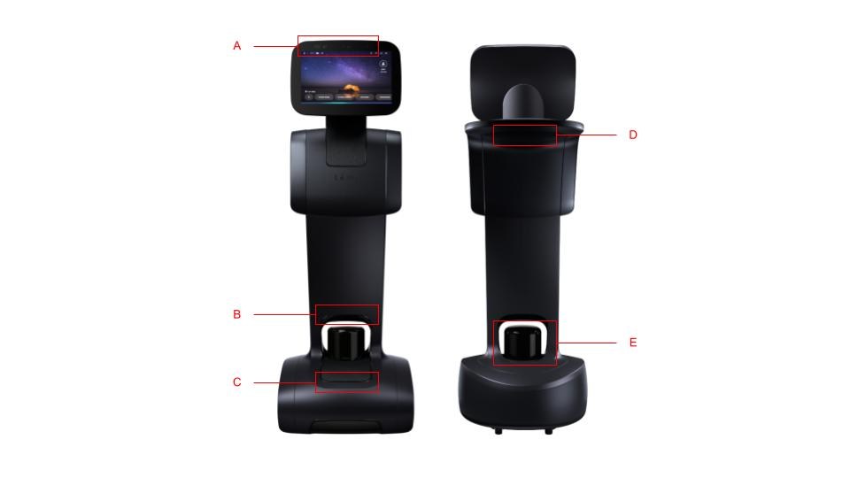
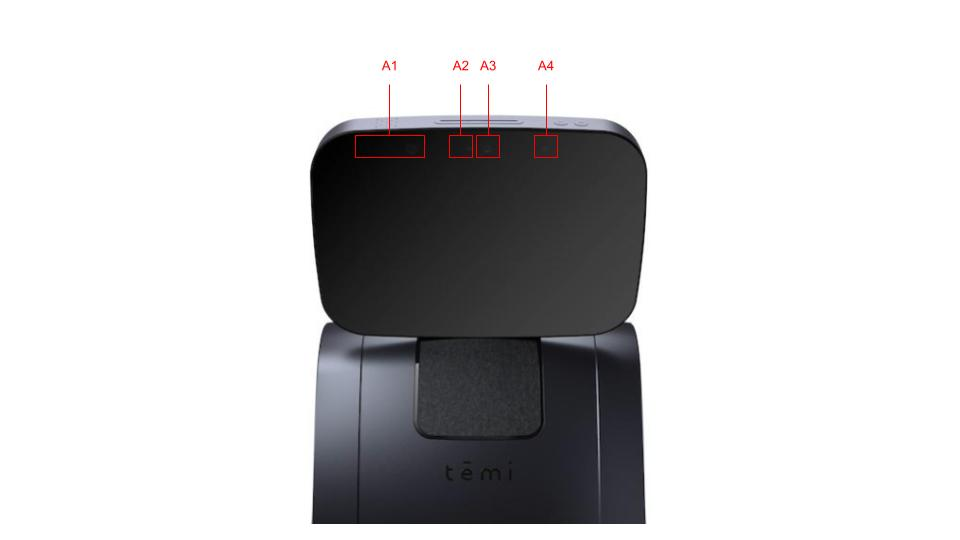

*************
Robot Sensors
*************

  Robot sensors: (A) Head sensors (see below for details), (B) ground depth sensor, (C) front ToF sensors, (D) rear ToF sensors, (E) LIDAR.
 

  Head sensors: (A1) head depth sensor, (A2) narrow-angle camera, (A3) wide-angle camera, (A4) RGB camera. 

.. Important::
  Ensure that the sensors are free of dust, fingerprints, or any occlusion. A micro-fiber cloth and/or compressed air duster can be used to clean the sensors.

.. As with all optical sensors, environmental lighting, as well as surface reflection, transmission, and absorption affect what the sensors are able to detect. In turn, these can affect navigation performance.

Cameras
=======
The two cameras located in the robot's head can be used by apps for taking photos and/or videos. They are not used for navigation.

+---------------------+------+------+
|                     | HFOV | VFOV |
+=====================+======+======+
| Narrow-angle camera | 60°  | 48°  |
+---------------------+------+------+
| Wide-angle camera   | 95°  | 60°  |
+---------------------+------+------+

RGB Camera
==========
This is a camera that is dedicated to tracking people. Blocking this camera will prevent the robot from following.

LIDAR
=====
The primary navigation sensor is the laser, imaging, detection, and ranging (`LIDAR <https://en.wikipedia.org/wiki/Lidar>`_) sensor. It is used for mapping the environment and it assists with detecting obstacles.

.. @TODO Multiple versions of the LIDAR

Depth Sensors
=============
The robot has 2 depth cameras. One that is embedded into the head, and one just above the LIDAR:

- **Head Depth Sensor**: This is used to assist with tracking people.  
- **Ground Depth Sensor**: This is used to detect obstacles directly in front of the robot on the floor.

.. @TODO Multiple versions of the Depth Camera

ToF Sensors
===========
The robot has two sets of Time-of-Flight (ToF) sensors. Three in the front pointing upwards, and three in the rear (under the tray) pointing downwards:

- **Front ToF Sensors**: These are used to detects obstacles, such as tables directly in front of the robot.
- **Rear ToF Sensors**: These are used to detect *cliffs*, e.g. stairs, escalators, genkan, etc. directly behind the robot when moving backwards.

.. Tip:: Do not rely on the depth cameras or the ToF sensors. They do not work reliably. We recommend reducing their use (e.g. lower the obstacle avoidance sensitivity or turn them off completely), and to use virtual walls in the map.
