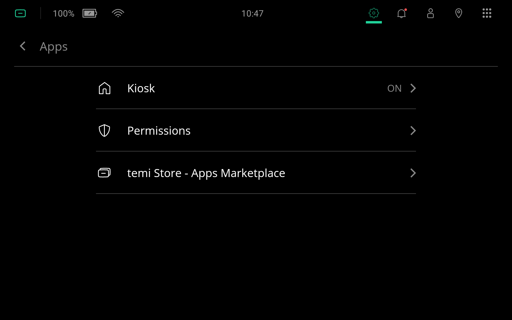
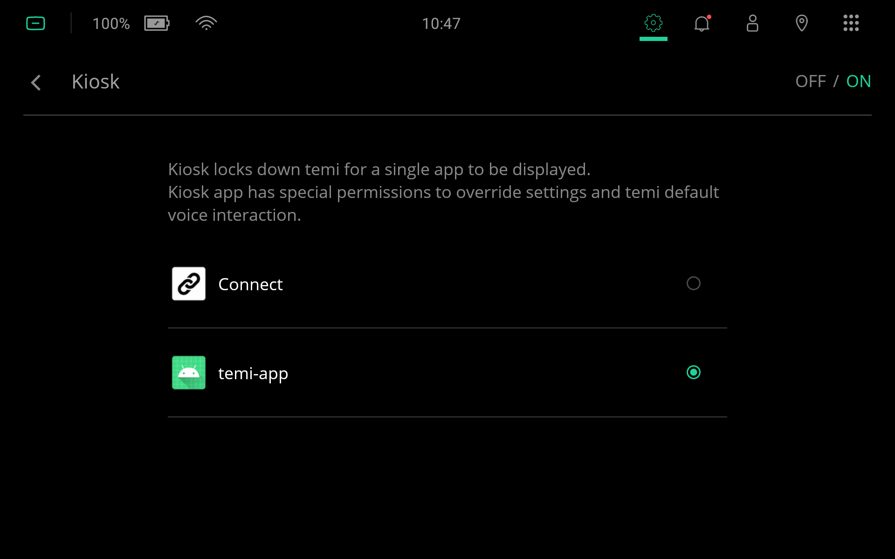
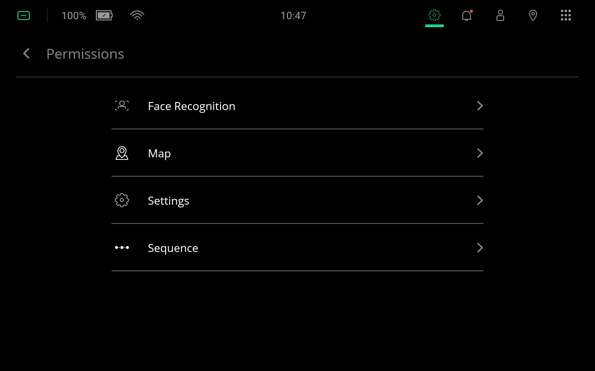
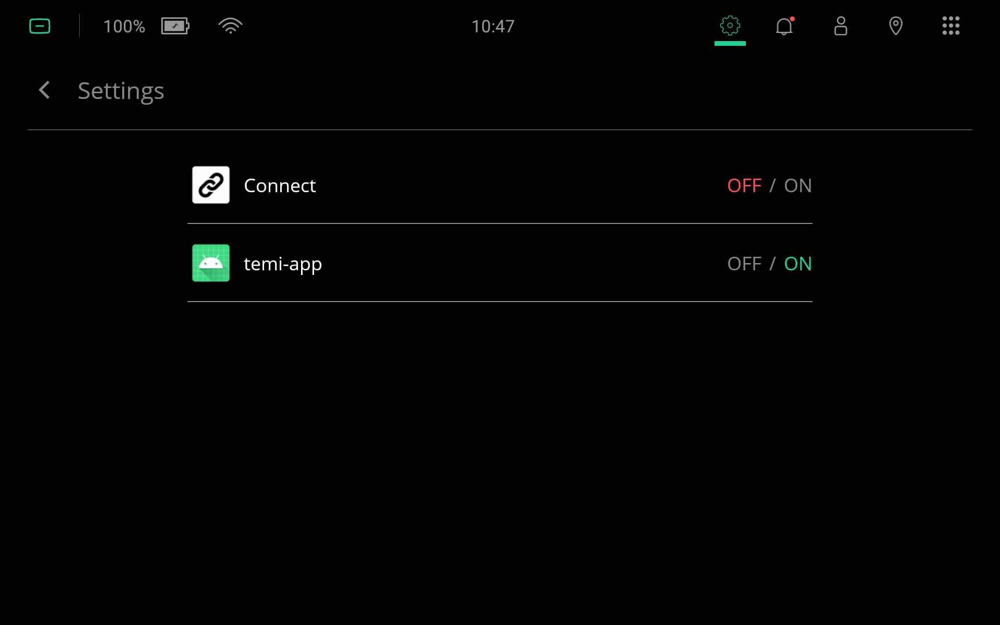
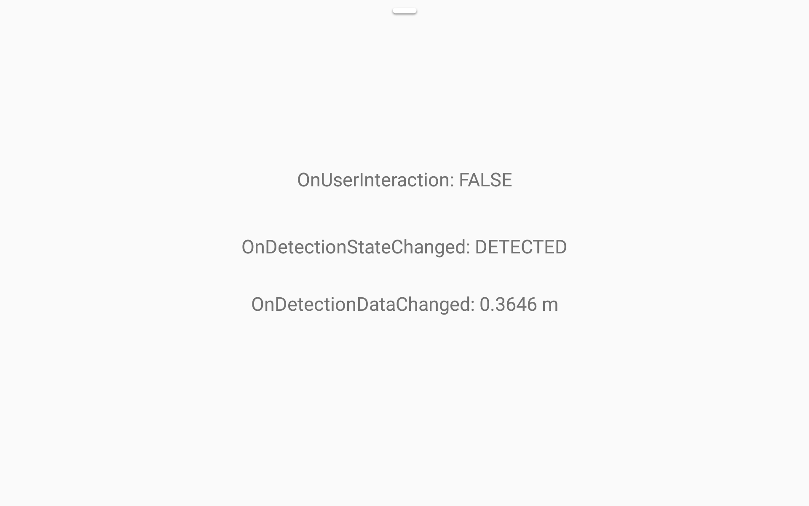

# User Detection
Example app used to test detection and tracking interface.

## Usage
- Run in [Kiosk Mode](https://github.com/robotemi/sdk/wiki/Kiosk-Mode).
- Enable Settings [Permission](https://github.com/robotemi/sdk/wiki/permission).

See [documentation](https://temi-guide.readthedocs.io/en/latest/developer/user-detection-tracking.html) for details.

## Instructions
The following instructions were tested to work on Launcher OS 14759 and Robox OS 124.97.

### Kiosk Mode
From `Settings` > `Apps`, select `Kiosk`.

In the top-right corner, turn `ON` Kiosk mode and select `temi-app`.

### Settings Permissions
From `Settings` > `Apps`, select `Permissions`.

Then select `Settings`.

Turn `ON` `temi-app`.

### temi-app
The app should automatically start in Kiosk mode when returning to the Home Screen. Event information should be provided on screen and/or in logcat.

